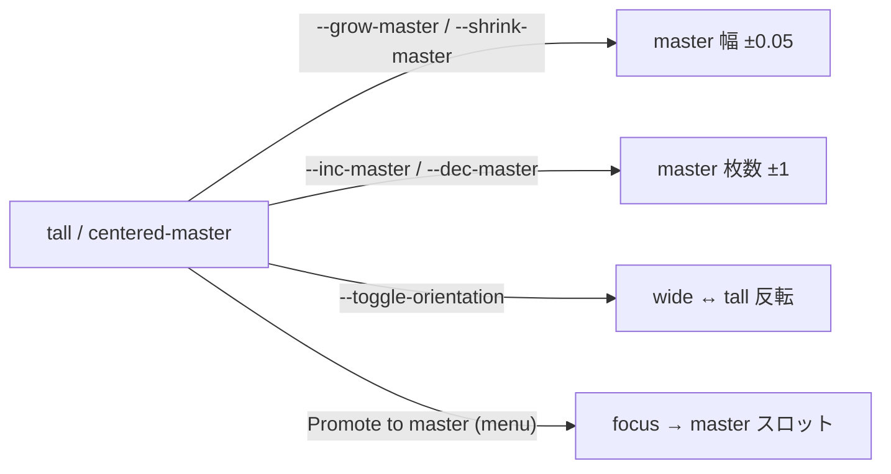
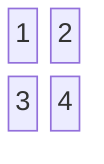

# facet


[English](README.md) · **日本語**

macOS 向け Swift 製ワークスペース + ウィンドウマネージャ。 同じ
ワークスペースモデルを **複数の view から切り替えて見る**
（半透明ツリーサイドバー、 フルスクリーンオーバービュー、
将来の dock / hover / palette 等）。 backend は AX/CGS を直接叩く
native 実装、 外部依存なし。 レイヤー図は
[docs/architecture.md](docs/architecture.md)。

## 何ができるか

facet は menu-bar-less な agent (`LSUIElement`) として常駐し、
ワークスペースを 2 種類の view で見せる。 起動時にどちらを表示する
かは [`config.toml`](config.toml) の `default-view` で選ぶ:

- **Tree** — 半透明・常時最前面のサイドバー。 各ワークスペースと
  その windows をツリー表示。 行クリックで focus、 window 行ドラッグで
  window を別 ws に移動、 ワークスペース header (左にグリップ) ドラッグ
  で 2 つのワークスペースの中身を swap、 ホバーで実画面プレビュー。
- **Grid** — フルスクリーンのオーバービュー。 1 セル =
  1 ワークスペース、 ScreenCaptureKit のリアルサムネイル、 セル間 DnD:
  window サムネイルドラッグで移動、 セル header ドラッグでセル丸ごと
  swap。 必要時に `facet --view=grid` で呼び出し、 Esc / 背景クリック
  で閉じる。

DnD は両 view 共通のモデル — **掴んだ対象が動作を決める**: window を
掴めば移動、 ワークスペース header を掴めば 2 ワークスペースの中身を
swap (ワークスペースの枠自体は動かないので hotkey 番号は不変)。 修飾
キーは使わない。

両 view は同じ backend と同じテーマ (terminal / cute / system、
ライブ切替) を共有。

## レイアウト

各ワークスペースは 1 つのレイアウトで動作し、 実行時に
`facet --set-layout=NAME` で切り替える (per-WS、 永続化しない —
起動時に選ぶなら [setup hook](#workspace-setup-hooks) を使う)。 facet
は window を隠さないので、 レイアウトは window を*配置*するだけで、
focus 中の window は常に前面に来る。 図は 4 window 想定、 **1** が
master / focus。

### `tall` — master + stack
dwm `tile` / xmonad `Tall`。 master が左カラム (幅の可変割合) を占め、
残りが右に行で積まれる。 ウルトラワイドの定番。

```
┌────────────┬───────────┐
│            │     2     │
│            ├───────────┤
│     1      │     3     │
│  (master)  ├───────────┤
│            │     4     │
└────────────┴───────────┘
```

### `wide` — master を上に
`tall` を 90° 回転 (`--toggle-orientation` で切替): master が上の行、
残りが下のカラムになる。

```
┌─────────────────────────┐
│        1 (master)       │
├───────┬───────┬─────────┤
│   2   │   3   │    4    │
└───────┴───────┴─────────┘
```

### `centered-master` — master を中央に
dwm `centeredmaster` / xmonad ThreeColMid。 master を中央に、 残りを
左右のサイドカラムに分配 (右から埋まる)。 ウルトラワイド向け。

```
┌───────┬───────────────┬───────┐
│       │               │   2   │
│   4   │   1 (master)  ├───────┤
│       │               │   3   │
└───────┴───────────────┴───────┘
```

### `grid` — 均等タイル
awesome `grid`。 ほぼ正方の格子 (`ceil(√N)` 列)、 最終行は幅いっぱいに
広がる。

```
 2 window          3 window           4 window
┌─────┬─────┐    ┌─────┬─────┐      ┌─────┬─────┐
│  1  │  2  │    │  1  │  2  │      │  1  │  2  │
└─────┴─────┘    ├─────┴─────┤      ├─────┼─────┤
                 │     3     │      │  3  │  4  │
                 └───────────┘      └─────┴─────┘
```

### `spiral` — フィボナッチ
dwm `fibonacci`。 新しい window が残り空間を半分にしながら時計回りに
内へ巻いていく。

```
┌────────────┬───────────┐
│            │     2     │
│     1      ├─────┬─────┤
│            │  4  │  3  │
└────────────┴─────┴─────┘
```

### `monocle` — 全画面フォーカス
dwm `monocle`。 全 window が画面いっぱい、 focus 中が前面 (他は背面に
原寸で控える — facet は隠さず focus を前面化する)。

```
┌─────────────────────────┐
│                         │
│     1  (2 3 4 は背面)    │
│                         │
└─────────────────────────┘
```

### `bsp` — 二分割
bspwm 流。 新しい window が focus 中のタイルを半分に割る (アスペクトで
自動バランス)。 `--toggle-orientation` で focus 中の split を回転。

```
┌────────────┬───────────┐
│            │     2     │
│     1      ├─────┬─────┤
│            │  3  │  4  │
└────────────┴─────┴─────┘
```

### `stack` — 1 つずつ
1 window が画面いっぱい、 残りは画面外に park。
`--cycle-stack=next|prev` で前面の window を巡回。

```
┌─────────────────────────┐    他 (2, 3, 4) は画面外に park。
│                         │    cycle-stack で次を前面に。
│       1  (前面)          │
│                         │
└─────────────────────────┘
```

`float` (デフォルト) はレイアウトを適用しない — window は置いた位置に
留まる。

### master-stack の操作

`tall` / `centered-master` は実行時に調整できる (per-WS)。 focus 中の
window を master スロットへ **昇格**:

```
  before (3 を focus)         after --promote (menu)
┌────────────┬───────┐      ┌────────────┬───────┐
│            │   2   │      │            │   1   │
│     1      ├───────┤  →   │     3      ├───────┤
│  (master)  │   3   │      │  (master)  │   2   │
└────────────┴───────┘      └────────────┴───────┘
```

master の **リサイズ** (`--grow-master` / `--shrink-master`、 ±0.05) と
**枚数変更** (`--inc-master` / `--dec-master`):



`grid` はブロック図にも素直に対応:



## 操作

| 操作 | 結果 |
|---|---|
| window 行クリック (tree) | そのワークスペースに切替 + その window に focus |
| ワークスペース header クリック (tree) | そのワークスペースに切替 |
| window 行を別ワークスペースにドラッグ (tree) | その window を移動 |
| ワークスペース header を別 header にドラッグ (tree) | 2 ワークスペースの中身を swap |
| 空白部分ドラッグ、 または ⌘+ドラッグ (tree) | パネル位置を変更 — 位置は永続 |
| 右クリック (tree) | コンテキストメニュー — window アクション / layout 切替 |
| window 行ホバー (tree、 macOS 14+) | ライブプレビュー — デフォルトは row 横の小型ポップオーバー。 `[tree] preview-mode = "mirror"` で実サイズ + WS 切替後の位置に切替可 |
| セルクリック (grid) | そのワークスペースに切替 |
| window サムネイルクリック (grid) | 切替 + その window に focus |
| サムネイルを別セルにドラッグ (grid) | その window を移動 |
| ワークスペース header を別セルにドラッグ (grid) | 2 セルの内容を丸ごと swap |

表示制御 / 非表示 / トグル / キーボードモードは全部 CLI 経由 —
[CLI](#cli) 参照。

### キーボードナビ

tree パネルは focus を持っている間、 キー入力に反応する。 focus 取得
方法は 2 通り:

- **パネルクリック** — `facet --view=tree` 単体は passive (= 邪魔
  しない)、 ユーザがクリックした瞬間にキーボードナビ ON。 他 app に
  focus 移すと OFF、 キー漏れなし。
- **`--active` フラグ** — `facet --view=tree --active` は即 focus 取得
  (= hotkey から 1 発でナビ突入、 クリック不要)。 代償: ナビ中 facet
  が active app になる (Dock + Cmd-Tab に表示)、 `Esc` で抜ければ元の
  app に focus 戻る。

| キー | アクション |
|---|---|
| `↓`/`↑`, `Ctrl-N`/`Ctrl-P`, `j`/`k` | 行間移動 |
| `Tab`/`⇧Tab`, `→`/`←`, `l`/`h` | 前/次ワークスペースへジャンプ |
| `s` | type-to-filter: 全ワークスペース横断 fuzzy 検索 (本物の text field、 IME 動く) |
| `Space` | 選択行を持ち上げて DnD — window 行は移動、 ワークスペース header は swap。 矢印で行き先ワークスペースを照準、 `Return`/`Space` で確定、 `Esc` でキャンセル |
| `m` | 選択行のコンテキストメニュー (キーボード操作可: `↑↓`/`Return`/`Esc`) |
| `Return` | 持ち上げ確定、 または (非持ち上げ時) クリックと同等に切替 + focus |
| `Esc` | 持ち上げキャンセル → filter クリア → keyboard mode 抜ける (パネルは表示維持) |

window タイトルは Accessibility (`kAXTitle`、 CGWindowID で
照合、 短 TTL キャッシュ) で解決。 タイトル解決できない行は
コンパクト表示。 Accessibility 権限必要 (クリックと同じ grant)。

### Grid オーバービューのキーボード操作

| キー | アクション |
|---|---|
| 矢印 | セルカーソル移動 |
| `Tab` / `⇧Tab` | 同一セル内の header + windows をカーソル循環 |
| `Space` | 選択を持ち上げて DnD — window (移動) か header スロット (セル丸ごと swap)。 矢印で照準、 `Return` で確定 |
| `Return` | 持ち上げ中なら確定 / 通常時は切替 |
| `Esc` | 持ち上げをキャンセル / オーバービューを閉じる |

セルは **ScreenCaptureKit サムネイル** (macOS 14+、 Screen Recording
権限必要) で描画。 バックグラウンド refresh でキャッシュを温めるので、
オーバービュー初回表示でアイコンフォールバックではなく実スクリーン
ショットが出る。

## インストール

```sh
brew install akira-toriyama/tap/facet

# facet は GUI agent — install だけでは起動しない。 1 度 app を開く:
open "$(brew --prefix)/opt/facet/Facet.app"

# 詳細コメント付き config を配置 (デフォルト値は妥当):
curl --create-dirs -o ~/.config/facet/config.toml \
  https://raw.githubusercontent.com/akira-toriyama/facet/main/config.toml
```

初回起動時、 *facet* に **Accessibility** 権限を付与 (System
Settings → Privacy & Security → Accessibility)、 でないとクリック /
ドラッグが効かない。 grid view のサムネイルが欲しければ **Screen
Recording** も付与。

`curl` の行で詳細コメント付きの [config.toml](config.toml) が
配置される。 デフォルト値は妥当で、 そのまま起動すれば tree view
(常駐サイドバー) が立ち上がる。 デフォルト view 切替・テーマ・
カラム数・ラベル位置等の変更はファイル内のコメントを参照。

## 設定

facet は `~/.config/facet/config.toml` を **読むだけ** (書き戻し
なし、 source of truth は 1 ファイル)。 設定可能な項目はリポジトリ
ルートの [config.toml](config.toml) のコメントを参照。 CLI override
(`facet --theme=cute` 等) はセッション中のみ有効; 永続化したい
場合はファイルを編集。

よく触る key:

- `theme` (トップレベル) — `terminal` (default) / `cute` / `system`
- `default-view` (トップレベル) — `tree` / `grid`
- `[workspace]` テーブル — `1 = "dev"`, `2 = "ide"`, … (1-indexed、
  sparse OK; 欠番 index は `--workspace=N` で invalid 扱い)。
- `[space.N]` テーブル — native Space ごとの workspace 名/数。 `N` は
  Mission Control 順の位置。 `[space.N]` が**1つも無ければ**全 native
  Space が自動でデフォルト workspace を持つ。 **1つでもあれば opt-in**:
  セクションのある Space だけ facet が管理し、 無い Space は完全に
  ノータッチ（窓そのまま・パネル非表示）。
- `[workspace] setup-files = [...]` — 起動時に 1 度だけ実行される
  実行可能 script のパス配列（Vitest 流）。 詳細は下の
  「Workspace setup hooks」 を参照。

### Workspace setup hooks

facet 自身は window-to-workspace の割当を永続化しない。
`setup-files` config key で、 起動時に「あなたの好みのレイアウト」
を再構築する script を自分で書ける — script は facet の CLI
listener が立ち上がった **後** に発火するので、 そのまま
`facet status` / `facet --workspace=N` / `facet window --move-to=N`
を呼べる (hotkey と同じ仕組み)。

```toml
[workspace]
setup-files = ["~/.config/facet/setup.sh"]
```

```sh
# ~/.config/facet/setup.sh (chmod +x)
#!/usr/bin/env bash
# アプリを希望の WS に予め立ち上げる。 新しい window は常に
# 「現在アクティブな facet WS」 に landing するので、 先に
# `facet --workspace=N` で切り替えてから `open` するのがコツ。
facet --workspace=2 && open -ga Slack
sleep 0.4               # Slack の window 登録を少し待つ
facet --workspace=1 && open -ga "Safari"
sleep 0.4
facet --workspace=1     # 最後に「見たい WS」 に戻して終了
```

(`facet window --move-to=N` は focused window 専用、 `--id` flag
は現状ない。 だから「事前に WS を切り替えてから open」 が
今正直に書ける唯一の起動 staging パターン。)

注意点:
- パス内の `~` / `$VAR` / `${VAR}` は展開される。
- script は実行可能 (`chmod +x`) であること。
- spawn 後は fire-and-forget — hung script で facet 起動が
  止まる事はない。 エラー (file 無し / 非実行 / non-zero exit)
  は `facet status` の `lastError` スロットに出る。
- full restart 時のみ再実行、 `facet --reload` では走らない (意図的)。
- stdout / stderr は `/tmp/facet.log` に記録される (`facet --debug` で可視化)。

## CLI

facet は **CLI 駆動**: 小さな flag set が稼働中の server に
distributed notification を投げる仕組み。 hotkey ツール (skhd /
Karabiner / Raycast / Hammerspoon / macOS Shortcuts 等) からこれら
を bind して使う想定。 完全リファレンスは `facet --help`。

```sh
# View 対称コマンド — NAME ∈ tree | grid、 全 op で必須
facet --view=NAME [--active]      # NAME 開く (idempotent)
facet --hide=NAME                 # NAME 閉じる
facet --toggle=NAME               # NAME トグル

# Tiling (M5 Phase γ)
facet --set-layout=NAME              # bsp | stack | tall | centered-master | grid | spiral | monocle | float
facet --retile                       # active WS のレイアウトを再適用 (任意の tiling mode)
facet window --toggle-float          # focused window の float flag flip
facet window --toggle-orientation    # bsp: 親 split を 90 度回転 / tall: wide↔tall 反転
facet window --cycle-stack=next|prev # stack の次 / 前メンバーへ循環
facet window --grow-master|--shrink-master   # master 幅 ±0.05 (tall / centered-master)
facet window --inc-master|--dec-master       # master 窓数 ±1 (tall / centered-master)

# --active は修飾子 — --view=tree と組み合わせた時のみ意味あり。
# --active なしでも tree パネルはクリックすればキーボードナビ ON
# になる; --active は hotkey から 1 発で focus 取得したい場合用
# (Spotlight 風起動)。 --view=grid と組み合わせると silent no-op
# (grid は常に key/active)。

# Workspace 操作 (M5 Phase α)
facet --workspace=N               # workspace N に切替 (1-indexed)
facet window --move-to=N          # focus 中の window を WS N へ
facet status                      # スナップショット: backend /
                                  # theme / workspaces /
                                  # lastError / timestamp

# Server 制御
facet --theme=NAME                # terminal | cute | system
facet --reload                    # config.toml 再読込 + 反映
                                  # (theme / preview-mode / [workspaces])
facet --quit                      # server 終了
facet --debug                     # verbose log (stderr +
                                  # /tmp/facet.log、 server-mode)
facet --resign                    # Facet.app 再 sign (brew install 後)
facet --help                      # 完全リファレンス
```

不明な flag / view / theme 名は exit `2` + stderr メッセージ —
typo は silent fail せず明示エラー。 短縮 (シェル alias / hotkey
バインド) は各自の環境の領分で、 facet 側では扱わない。

### ホットキー連携

facet は CLI のみ提供 — ホットキーは使い慣れたツールで。 例:

**[chord](https://github.com/akira-toriyama/chord)** — facet の
兄弟プロジェクト。 TOML 駆動のキーボード + マウス hotkey daemon
for macOS。 facet と同じ hexagonal Swift 構造、 GUI なし、
config 1 ファイル。

```toml
[[bindings]]
name   = "facet workspace 1"
input  = "ctrl + alt - 1"
action-shell = "/opt/homebrew/bin/facet --workspace=1"

[[bindings]]
name   = "move focused window to workspace 1"
input  = "ctrl + shift + alt - 1"
action-shell = "/opt/homebrew/bin/facet window --move-to=1"
```

**skhd** (`~/.config/skhd/skhdrc`):

```
ctrl + alt - 1          : facet --workspace=1
ctrl + alt - 2          : facet --workspace=2
ctrl + shift + alt - 1  : facet window --move-to=1
ctrl + shift + alt - 2  : facet window --move-to=2
```

**Karabiner-Elements**: *Complex Modifications* の JSON で
`shell_command` に `/opt/homebrew/bin/facet --workspace=1` 等を
指定。

**Hammerspoon**: `hs.hotkey.bind({"ctrl","alt"}, "1", function()
hs.execute("/opt/homebrew/bin/facet --workspace=1") end)`。

#### おまけ: native Space 切替のローディングスケルトン

フレーム単位が気になるあなたへ。 macOS は「Space 切替が *これから*
始まる」 フックを出してくれないので、 facet が切替を知るのはスライド
*後* — 切替先デスクトップに前デスクトップの tree が一瞬チラッと残る、
ちょうどそのくらい遅い。 額に入れて飾るような美しい解ではない。

でも、 その 1 フレームのチラつきが我々と同じくらい気になるなら: ホット
キーツールで Space 切替キーの *直前* に `facet --view=tree --loading=2000`
を撃つ。 facet は tree にスケルトンを被せ、 スライド中ずっと保持し、
切替先デスクトップの workspace がロードされた瞬間（または 2 秒経過、
早い方）に外す。 [chord](https://github.com/akira-toriyama/chord) なら
`action-shell` が先に走り、 `action-keys` が本来のキーを送る:

```toml
[[bindings]]
name         = "space-left + facet tree"
input        = "ctrl + fn - left"
action-shell = "facet --view=tree --loading=2000"
action-keys  = "ctrl + fn - left"
```

ハック？ 間違いなく。 1 フレームに気づいてしまう人へのささやかな
ラブレター？ それも。 💙

### Workspace shell ヘルパー

facet 本体は `config.toml` に書き込まない方針。 repo 同梱の
shell スクリプトで atomic write (`mktemp` + `mv`、 ConfigWatcher
が中途半端な状態を見ない契約):

```sh
./scripts/add_workspace.sh 1 dev      # [workspace] に 1 = "dev" 追加
./scripts/add_workspace.sh 5          # 名前空、 スロットだけ作る
./scripts/remove_workspace.sh 2       # エントリ 2 を削除 (冪等)
```

facet の `ConfigWatcher` が変更を自動 pick up。 `facet --reload`
は明示 trigger 版で、 スクリプトが反映タイミングを確実に制御
したい時に使う。

## デバッグ

`--debug` フラグで `/tmp/facet.log` への出力を stderr にもミラー
し、 verbose トレース (refresh tick、 backend command、 focus
retry、 grid DnD イベント等) を有効化:

```sh
.build/release/facet --debug              # foreground でイベント流れる
.build/release/facet --debug 2>&1 | tee bug.log   # issue 用にキャプチャ
```

`--debug` は server 起動時のみ有効 (`--show` 等の client mode flag
と併用しても no-op)。 通常起動では stderr は静か、 `Log.debug` 呼出
もゼロコスト。

## ソースからビルド

```sh
./run.sh             # release ビルド → 起動中の instance kill → Facet.app 起動
./run.sh --dev       # 同じだが Facet-dev.app を作る (bundle id 別、
                     #   Homebrew 版と並行運用したい時用、 TCC 分離)
./stop.sh            # 起動中の facet 全部 kill (release / dev / raw SwiftPM)
```

`./run.sh` が日常の rebuild ループ — bundle 差し替えて再起動まで
1 コマンド。 `./stop.sh` は「どれが動いてるか分からなくなった時」
の保険。

bundle 化せずに verify だけ:

```sh
swift build          # コンパイルのみ
swift test           # XCTest — Xcode 必要 (CLT には入ってない)
```

## 正直な制限事項

- **Apple Silicon 専用**。 Intel Mac は対象外。
- **multi-display の layout / preview 位置は軽くしかテストして
  いない** — 主開発機がシングルディスプレイ。 multi-monitor 環境
  で挙動がおかしい場合は再現手順付きで issue 報告を。
- **window preview は macOS 14+** + Screen Recording 権限が必要。
- **Ad-hoc 署名は rebuild ごとに Accessibility 再要求**。
  `./setup-signing-cert.sh` を 1 度走らせると persistent な
  self-signed identity ができ、 rebuild 跨ぎで TCC grant が維持
  される (Homebrew install では install サブプロセスが login
  keychain にアクセスできず ad-hoc になる — upgrade ごとに
  再要求)。
- **drop target はワークスペースの縦バンド単位** (tree view)。
  空のワークスペースへのドロップも可 (header band が target)。
- **WS 全体プレビュー** (ワークスペース header ホバー) は、 その
  ワークスペースの window 数だけ overlay を並列キャプチャするので、
  10+ window あると初回ホバーで CPU 一時 spike。
- **チューニング定数は `Sources/Facet*/Tunables.swift`** に各
  module ごと配置。 散らかった literal より、 これらの const を
  調整するのを優先。

## 「facet」 という名前

同じ workspace データを **角度を変えて複数の view で見る** — 
サイドバーの行、 grid のタイル、 dock のチップ、 等。 それぞれが
ワークスペースモデルの一つの **facet (面)**。 アーキテクチャも
同じ思想：1 つの core、 複数の adapter、 複数の view。

## ライセンス

[MIT](LICENSE) © akira-toriyama
