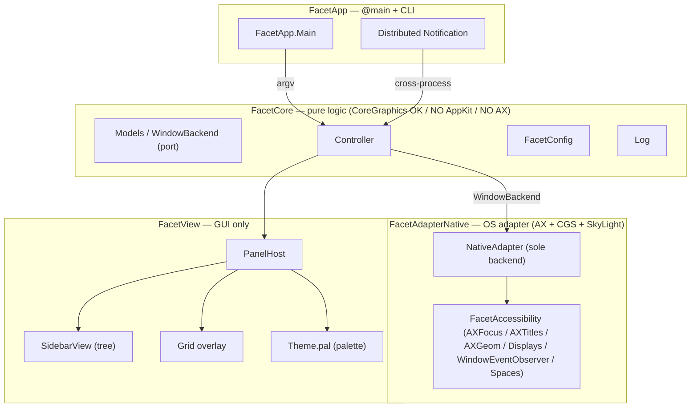

# 用語集 — facet のユビキタス言語

facet を構成する各パーツの **正規の呼び名** をまとめた規範ドキュメント。
**コード・ドキュメント・コミットメッセージ・PR タイトル・Claude Code への
プロンプト、すべてここに載っている名前のみを使う**。同義語は揺らぎを生む。
1 つに決めて、それで通す。

なお **正規名は英語のまま** 保持する。コード識別子・設定キー
（`FacetCore`, `WindowBackend`, `[space.N]`, `pal` など）と一対一に対応
させるため。日本語化するのは説明文だけ。

用語が足りなければ、その用語を導入する PR で同時にこのファイルへ追記する。
用語名を変える場合は、コード・ドキュメント・このファイルを **同一 PR で**
書き換える。

> 各エントリの形式: **正規名**, 1〜2 行の定義, 設定 / コードでの所在,
> そして `Don't call it:` 行 — このエントリが置き換える誤った呼び名のリスト。

---

## アーキテクチャ全体像

facet は **ヘキサゴナル 3 層分割**（[docs/architecture.md](architecture.md)）。
下の図は層と主要な seam を示す。レイヤーをまたぐ型は常に protocol を介す。

---

## レイヤー / モジュール

### FacetCore
**純ロジック層**。CoreGraphics の値型は OK だが AppKit / AX / バックエンド型
は持ち込まない。XCTest で単体検証可能であることが層境界の根拠。
- 場所: [`Sources/FacetCore/`](../Sources/FacetCore/)
- 含むもの: `Models`, `WindowBackend` protocol, `Controller`, `FacetConfig`, `Log`
- **Don't call it:** domain layer, business logic, model layer, ドメイン層

### FacetAdapterNative
**唯一の backend adapter**（v2.0.0 で `rift` 廃止）。AX / CGS / SkyLight
プライベート API への入口。バックエンド固有の型は **この中に閉じ込める**。
- 場所: [`Sources/FacetAdapterNative/`](../Sources/FacetAdapterNative/)
- **Don't call it:** native backend, ax adapter, アダプタレイヤー（一般化したい時のみ）

### FacetAccessibility
M5 で抽出した **AX ヘルパ群**。`AXFocus`, `AXTitles`, `Focus.assert /
withRetry`, `AXGeom`, `Displays`, `WindowEventObserver`, `Spaces` がここに
住む。Phase ε 後の唯一の consumer は `FacetAdapterNative`。新規 AX コードは
backend 固有でない限りここへ。
- 場所: [`Sources/FacetAccessibility/`](../Sources/FacetAccessibility/)
- **Don't call it:** ax utils, accessibility helpers, AX ユーティリティ

### FacetView
**GUI 専用層**。View は `WindowBackend` protocol だけを見る。具体 adapter を
直接参照しない。
- 場所: [`Sources/FacetView/`](../Sources/FacetView/)
- **Don't call it:** ui layer, presentation layer, ビュー層

### WindowBackend (port)
Core と Adapter の間の **唯一の seam**（hexagonal port）。Controller / View
が見るのはこの protocol のみ。
- 定義: [`Sources/FacetCore/`](../Sources/FacetCore/) 内
- **Don't call it:** adapter protocol, backend interface, バックエンド契約

---

## ドメインモデル

### workspace
**ユーザー定義の Window 集合**。タブのようにグループ化された window 群を
1 まとまりとして扱う単位。
- コード: `WorkspaceCatalog` / `workspaces()`
- **Don't call it:** group, tab, page, グループ, タブ

### per-native-Space workspaces
macOS の各 native Space ごとに **独立した `WorkspaceCatalog`** を持つ機能。
`NativeAdapter` は active Space id でカタログを park / swap する。SkyLight
は **read-only** 利用（書き込みは SIP-off 必要）。SkyLight 未利用環境では
`activeSpaceID == 0` で 1 つの shared catalog に縮退（pre-feature 挙動）。
- 設定: `[space.N]` キー（ordinal で指定）
- コード: `Spaces`（in `FacetAccessibility`）, `FacetConfig.isSpaceManaged`
- **Don't call it:** virtual desktop workspace, multi-desktop, デスクトップ別

### view
ユーザー向け UI surface の種類。`tree` / `grid` などが正規名（`canonicalViews`）。
新規 view 追加時は `Main.canonicalViews` + `Controller.dispatchView/Hide/Toggle`
の case を増やすだけで済むよう **per-view 専用フラグを作らない**。
- CLI: `--view=NAME` / `--hide=NAME` / `--toggle=NAME`
- **Don't call it:** mode, panel, window, モード, ペイン

### tree view
左サイドバーに表示する **workspace の階層リスト**。`SidebarView` がレンダリング。
- コード: `SidebarView`
- **Don't call it:** sidebar, outline, list, サイドバー（描画される場所を指す時のみ別）

### grid view
全画面の **window グリッド overlay**。`--view=grid` で起動。常に key/active
（construction 上）なので `--active` 修飾子は無視される。
- **Don't call it:** mosaic, overview, expose, モザイク, グリッド表示

### AX target
**現在 facet が操作対象とする window**。`Window.title` は backend だけで
埋まるとは限らず、`AXTitles.resolve` が `kAXTitle` を short-TTL で解決する
（memory `[[window-titles-AX-resolved]]`）。
- コード: `AXTitles` / `AXFocus`
- **Don't call it:** focused window, active window, frontmost window,
  target app, フォーカスウィンドウ, アクティブウィンドウ

### BSP tiling / stack tiling
γ Phase で導入された 2 種の tiling layout。`facet workspace --layout=NAME`
で切替。AX role が `dialog` / `sheet` / `palette` の window は **auto-float**
（tiling 対象外）。
- CLI: `--layout=NAME` / `--retile`, `facet window --toggle-float` /
  `--toggle-orientation` / `--cycle-stack=next|prev`
- **Don't call it:** auto layout, window split, ウィンドウ分割

### loading skeleton
Space 切替時の flicker を隠す **CLI-triggered な skeleton 表示**。
`facet --view=tree --loading[=MS]` を **switch キー押下より前に** 外部から
発火させる（macOS は pre-Space-switch hook を出さないため auto trigger 不可）。
- コード: `Controller.showLoading` → `SidebarView` の skeleton
- **Don't call it:** placeholder, loader, spinner, ローディング表示

---

## CLI / IPC

### DNC (Distributed Notification)
プロセス間 IPC の通り道。`facet --view=tree` のような CLI 呼び出しは
`com.facet.app` 宛の Distributed Notification として届く。
- **Don't call it:** ipc message, event, distributed event, IPC イベント

### `--active` modifier
view を出す動作の **修飾子**（verb ではない）。`--view=tree` と組合せた時のみ
意味を持ち、key focus を即時奪う（+ activation policy フリップ）。grid view
では無視。
- **Don't call it:** focus flag, activate flag, アクティブフラグ

### typo rejection
未知の view / theme 名は `exit 2` + stderr で **明示エラー**。silent fallback
は意図的に出さない。
- 反例: TOML キーの値は **clamp**（typo 起こしても layout が壊れない方針）
- **Don't call it:** strict mode, fail-fast, 厳密モード

---

## 設定 / Theme

### `config.toml`
リポジトリルートの `config.toml` が **source-of-truth テンプレート**。
ユーザーは `curl` して `~/.config/facet/config.toml` に置く。app は読むだけ
（書かない / 自動生成しない / 永続化しない）。memory `[[config-default-behavior]]`。
- **Don't call it:** settings, preferences, user config, 設定ファイル（一般指示語）

### effective accessors
`FacetConfig` の `effective*` プロパティ。out-of-range / unknown 値を
**default に clamp** して返す。raw Optional は読まずに必ずこちらを通す。
- **Don't call it:** safe getters, validated accessors, バリデート getter

### `pal` (palette)
`Sources/FacetView/Theme.swift` の **`@MainActor` module-level var**。
view ファイルが `pal.text` / `pal.dim` などを直接参照する。**改名しない**
（view 側 ~数百箇所の変更を引き起こすが behavior 利得ゼロ）。
- preset: `.terminal` / `.cute` / `.system`（`NSColor` が Sendable でない
  ため `@MainActor`）
- **Don't call it:** theme.current, currentPalette, theme, テーマ

---

## ログ / 観測

### `Log.line`
**常時 ON** のログ関数。end-user 向けの operational event（AX focus
mismatch 等）を出す用途。
- **Don't call it:** info log, always-on log, 通常ログ

### `Log.debug`
**`debugMode` global で gate**（`facet --debug` 起動時のみ）。Controller /
Adapter / EventSource の hot path で気軽に使う。
- 出力先: `/tmp/facet.log` 常時 + `--debug` 時のみ stderr ミラー
- **Don't call it:** verbose log, trace log, 詳細ログ

### `FlippedClipView`
day-one から使う `NSClipView` 派生。非 flipped を使うと grip-drag が
散発的に失敗する（memory `[[grid-branch-grip-intermittent]]`）。**初日から
全 scroll view に投入**。
- **Don't call it:** custom clip view, fixed clip view, クリップビュー

### drag-state lifecycle
drag 状態は **backend round-trip 完了で clear**（`mouseUp` で clear しない）。
- **Don't call it:** mouse drag flag, drag state, ドラッグ状態（一般語として
  はあえて避ける）

---

## バンドル / 配布

### bundle id `com.facet.app`
TCC grant と self-signed cert identity の鍵。**変えない**（M2 で確定）。
- 設定: [`package.sh`](../package.sh)
- **Don't call it:** app identifier, app id, バンドル ID

### sole backend (`rift` 廃止)
v2.0.0 で旧 `rift` adapter を retire し、`FacetAdapterNative` が唯一の
backend に。Phase ε で完了。新規 adapter を足す場合も view 側変更不要
（`WindowBackend` port 経由のため）。
- **Don't call it:** legacy backend, primary backend, メイン backend

---

## エントリ追加時のルール

- 1 つの概念につき正規名は 1 つ。複数の呼び方が流通しているなら、
  このファイルで勝者を選び、敗者は `Don't call it:` 行に並べる。
- 正規名は **英語のまま** 書く。コード識別子（`FacetCore`, `pal`,
  `[space.N]`）はその表記を維持する。
- 定義は **1〜2 文** に収める。動作の詳細は設定セクションやソース
  ファイルへリンクし、ここで説明し直さない。
- 用語が CLI surface / DNC / config に表面化する場合は CLI フラグ名を
  必ず併記する。
