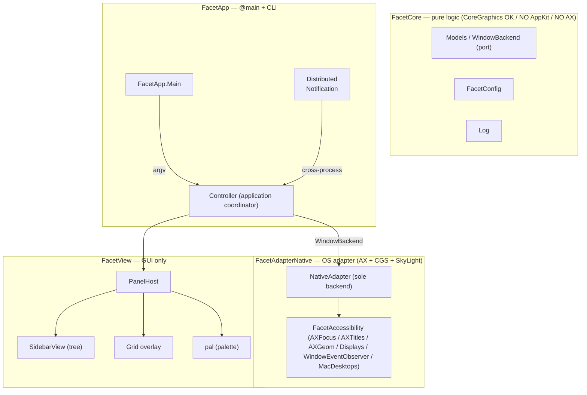

# 用語集 — facet のユビキタス言語

facet を構成する各パーツの **正規の呼び名** をまとめた規範ドキュメント。
**コード・ドキュメント・コミットメッセージ・PR タイトル・Claude Code への
プロンプト、すべてここに載っている名前のみを使う**。同義語は揺らぎを生む。
1 つに決めて、それで通す。

なお **正規名は英語のまま** 保持する。コード識別子・設定キー
（`FacetCore`, `WindowBackend`, `[[desktop.N.section]]`, `pal` など）と一対一に対応
させるため。日本語化するのは説明文だけ。

なお **似て紛れやすい 5 概念** は最優先で区別する（下の「5 つの中核概念」を
参照）。とくに **mac desktop**（OS の native Space）と **facet workspace**
（facet 独自の抽象）は語感が近く混同の温床なので、コード識別子・設定キー・
コメントすべてで綴り分ける。**lens** と **active section** も
（"保存された可視フィルタ（type=lens）" × "いま active な唯一の section"）として綴り分ける。

用語が足りなければ、その用語を導入する PR で同時にこのファイルへ追記する。
用語名を変える場合は、コード・ドキュメント・このファイルを **同一 PR で**
書き換える。

> 各エントリの形式: **正規名**, 1〜2 行の定義, 設定 / コードでの所在,
> そして `Don't call it:` 行 — このエントリが置き換える誤った呼び名のリスト。

---

## アーキテクチャ全体像

facet は **ヘキサゴナル 3 層分割**（[docs/architecture.md](architecture.md)）。
下の図は層と主要な seam を示す。レイヤーをまたぐ型は常に protocol を介す。



---

## レイヤー / モジュール

### FacetCore
**純ロジック層**。CoreGraphics の値型は OK だが AppKit / AX / バックエンド型
は持ち込まない。XCTest で単体検証可能であることが層境界の根拠。
- 場所: [`Sources/FacetCore/`](../Sources/FacetCore/)
- 含むもの: `Models`, `WindowBackend` protocol, `FacetConfig`, `Log`
  （`Controller` は AppKit に依存する Application coordinator なので
  [[FacetApp]] 側。architecture.md の Application 層に一致）
- **Don't call it:** domain layer, business logic, model layer, ドメイン層

### FacetAdapterNative
**window 管理の唯一の backend adapter**（v2.0.0 で `rift` 廃止。画像 capture は
別軸の [[FacetCapture]]）。AX / CGS / SkyLight プライベート API への入口。
[[WindowBackend]] を実装。バックエンド固有の型は **この中に閉じ込める**。
- 場所: [`Sources/FacetAdapterNative/`](../Sources/FacetAdapterNative/)
- **Don't call it:** native backend, ax adapter, アダプタレイヤー（一般化したい時のみ）

### FacetCapture
**画像 capture adapter**（P7）。`ScreenCaptureKit` の唯一の consumer で、
FacetCore の [[WindowCapturing]] port を実装（`SCKWindowCapture`、macOS 14+）。
window 管理（AX/CGS）とは別軸の backend なので [[FacetAdapterNative]] に畳まず
独立モジュールにする。`FacetView` は capture backend を import しない。
- 場所: [`Sources/FacetCapture/`](../Sources/FacetCapture/)
- **Don't call it:** preview module, screenshot adapter, WindowPreview（旧 FacetView 内の型名・P7 で改名移設）

### FacetAccessibility
M5 で抽出した **AX ヘルパ群**。`AXFocus`, `AXTitles`, `Focus.assert /
withRetry`, `AXGeom`, `Displays`, `WindowEventObserver`, `MacDesktops` がここに
住む。Phase ε 後の唯一の consumer は `FacetAdapterNative`。新規 AX コードは
backend 固有でない限りここへ。
- 場所: [`Sources/FacetAccessibility/`](../Sources/FacetAccessibility/)
- **Don't call it:** ax utils, accessibility helpers, AX ユーティリティ

### FacetView
**GUI 専用層**。View は `WindowBackend` protocol だけを見る。具体 adapter を
直接参照しない。
- 場所: [`Sources/FacetView/`](../Sources/FacetView/)
- **Don't call it:** ui layer, presentation layer, ビュー層

### WindowBackend (port)
Core と **window 管理 adapter** の間の seam（hexagonal port）。workspaces /
move / focus / switch / layout / display / event stream を抽象化。Controller /
View が見るのはこの protocol のみ。capture は別 port（[[WindowCapturing]]）。
- 定義: [`Sources/FacetCore/`](../Sources/FacetCore/) 内
- **Don't call it:** adapter protocol, backend interface, バックエンド契約

### WindowCapturing (port)
Core と **capture adapter** の間の seam（hexagonal port・P7）。per-window 画像
capture（overview サムネ + tree hover preview）を抽象化。[[WindowBackend]] とは
直交する別軸（window 管理 ではなく描画用 asset の取得）。`CGImage` を返す
（FacetCore は AppKit-free）＝view 側が `NSImage` に包む。唯一の実装は
[[FacetCapture]] の `SCKWindowCapture`（ScreenCaptureKit、macOS 14+）。
- 定義: [`Sources/FacetCore/WindowCapturing.swift`](../Sources/FacetCore/WindowCapturing.swift)
- **Don't call it:** preview protocol, screenshot interface, WindowPreview（旧型名）

---

## ドメインモデル

### 5 つの中核概念（最優先で区別する）

似た語が複数の意味で流通していた歴史があるため、まずこの 5 つを綴り分ける。

| 正規名 | 意味 | コード / 設定での所在 |
|---|---|---|
| **mac desktop** | macOS の native Space（OS の仮想デスクトップ。Mission Control の "Desktop N"） | `MacDesktops`, `activeMacDesktopID`, `[[desktop.N.section]]` |
| **facet workspace** | facet 独自の window グループ抽象（1 mac desktop に N 個） | `WorkspaceCatalog`, `workspaces()` |
| **facet view** | ユーザー向け UI surface の種類（`tree` / `grid` / `rail`） | `--view NAME`, `FacetView*`, `canonicalViews` |
| **lens** | section モデルの cross-workspace exclusive な可視フィルタ（`type="lens"` section）。`facet lens NAME` で active 化すると match 非一致の窓を全 workspace 横断で park する | `facet lens`, `WorkspaceCatalog.activeSectionLens` |
| **active section** | section モデルで **いま active な唯一の section**＝active lens（`type=lens`）XOR active workspace。常に 1 つだけ active | `ActiveSection`, `WorkspaceCatalog.activeSection`, `WindowBackend.activateSection` |

**mac desktop ↔ facet workspace は最重要の混同ポイント**。OS のデスクトップ
（mac desktop）と facet の抽象（facet workspace）は別物で、1 mac desktop が
複数の facet workspace を抱える（[[per-mac-desktop workspaces]]）。M11-2 で
両者を 1:1 にする予定だが、それは**実装上の関係**であって、概念としては
区別し続ける。**facet view ↔ lens** も直交軸（"どう見せるか" × "どのタグ集合
を見るか"）として分ける。

### mac desktop
macOS の **native Space**（OS が提供する仮想デスクトップ。Mission Control が
"Desktop 1" / "Desktop 2" … と表示するもの）。facet はこれを **read-only** に
しか触らない（別 mac desktop への window 移動は SIP-off が要るので非対応）。
- コード: `MacDesktops`（in `FacetAccessibility`・SkyLight 経由の read-only
  クエリ）, `NativeAdapter.activeMacDesktopID`
- 設定: `[[desktop.N.section]]` ブロック（Mission Control 順の ordinal で指定）
- UI: tree の上部ハンドル帯に "Desktop N"（macOS の呼称に合わせた表示ラベル）
- **Don't call it:** Space, native Space, workspace, virtual desktop（facet
  workspace と紛れる）, デスクトップ別
  - ※ Apple の API 名（`SLSGetActiveSpace`, `NSWorkspace.activeSpaceDidChange`,
    SLS の `"Spaces"` dict キー等）は Apple の語のまま残す。"mac desktop" に
    綴り替えるのは facet 自身の surface だけ。

### facet workspace
**facet が定義する Window 集合**。タブのようにグループ化された window 群を
1 まとまりとして扱う単位。1 つの [[mac desktop]] が複数の facet workspace を
持つ。**workspace は config から命名できない**（旧 `[desktop.N]` の by-name seed は
廃止）。**section モデル（[[section]] type=workspace）が active な desktop では
auto 命名**＝emoji プール（animal→fruit→food・🐶🍎🍕・`WorkspaceNaming`・index キー）。
それ以外の desktop は既定の無名スロット。名前変更は実行時 `facet workspace --rename`
のみ（session-only）。workspace は空間スロット＝意味は [[section]] / tag が担う。
- コード: `WorkspaceCatalog` / `workspaces()` / `WorkspaceNaming`（auto名・FacetCore）
  / `FacetConfig.effectiveWorkspaceList`（section active 時は auto名スロットを返す）
- **Don't call it:** group, tab, page, desktop, mac desktop, Space, グループ, タブ

### 迷子 (orphan)
**どの [[facet workspace]] にも属さない窓**（`WindowSlot.workspace == nil`・EX-3
排他モデルの `workspace = 0 or 1`）。窓を [[lens]] へ DnD すると元の workspace から
外れる「全部移動」の代償として発生しうる（`ws=nil`・lens の tag は持つので厳密な
"tag も 0" とは限らない）。**迷子は invisible-but-logged**＝一致する lens が active で
ない限りどの per-workspace view にも出ず（`snapshot` から除外・`facet query` では
`workspace="迷子"`/index 0）、WS1 へ auto-home し**ない**（ユーザ責任・canon ⑧）。
**迷子受け皿** = `type="lens"` + `match='not workspace'` の section を config に明示
記述すると、その lens を active 化して迷子を集約できる（専用 `unassigned` type は
作らない・canon ⑦ Q20）。「workspace を持つか」は**割当（`Int?` の nil）で判定**＝
無名 workspace（name `""`）の窓は assigned 扱いで `not workspace` に**出ない**。
- コード: `WindowSlot.workspace: Int?` / `WorkspaceCatalog.setOrphan` /
  `WindowBackend.orphanWindow` / `ProjectedWindowFields.workspaceName: String?`
  （nil=未割当）/ `ApplyResolver.Plan.relocateSourceToOrphan`
- **Don't call it:** unassigned（type は作らない）, lost window, untagged
  （無タグ ≠ 迷子）, homeless, デタッチ窓

### per-mac-desktop workspaces
各 [[mac desktop]]（native Space）ごとに **独立した `WorkspaceCatalog`** を
持つ機能。`NativeAdapter` は active な mac desktop id でカタログを park / swap
する。SkyLight は **read-only** 利用（書き込みは SIP-off 必要）。SkyLight
未利用環境では `activeMacDesktopID == 0` で 1 つの shared catalog に縮退
（pre-feature 挙動）。**opt-in 管理は `[[desktop.N.section]]` ブロックが
在れば発火**（section-only config も managed 化）。`type=workspace` [[section]] が
1 つでも在れば section モデルが active 化し、その desktop の workspace 数 +
各 layout を section が決める（lens-only desktop は既定 5 workspace に縮退）。
- 設定: `[[desktop.N.section]]`（[[section]]・ordinal で指定）
- コード: `MacDesktops`（in `FacetAccessibility`）, `FacetConfig.isMacDesktopManaged`
  / `FacetConfig.isSectionModelActive`（section モデル発火の gate）
- **Don't call it:** per-native-Space workspaces（コメント / メモリでは旧称が
  残る）, virtual desktop workspace, multi-desktop, デスクトップ別

### facet view
ユーザー向け UI surface の種類。`tree` / `grid` / `rail` が正規名（`canonicalViews`）。
新規 view 追加時は `Main.canonicalViews` + `Controller.dispatchView/Hide/Toggle`
の case を増やすだけで済むよう **per-view 専用フラグを作らない**。`--view`
（どう見せるか）は [[lens]]（どのタグ集合を見るか）と直交する別軸。
- CLI: `--view NAME` / `--hide NAME` / `--toggle NAME`
- **Don't call it:** mode, panel, window, lens（lens は表示中タグ集合の別概念）,
  モード, ペイン

### lens
section モデルの **cross-workspace exclusive な可視フィルタ**＝`type="lens"` の
[[section]]（保存された SQL VIEW）。`facet view` が "どう見せるか" なのに対し
lens は "どの窓集合を見るか"＝直交する別軸。`facet lens NAME` で active 化すると、
その `match`（[[facet filter]] WHERE 式・例 `tag~=web or app=Safari`）を満たさない
窓を **全 workspace 横断で [[anchor]] park**（cross-workspace exclusive な実 hide）し、
一致する窓集合をその lens の `layout`（stateless engine）で **union タイル**する。
これは唯一の [[active section]] を選ぶ操作であり（[[active lens]]）、workspace を
切り替えると lens は自動解除される。詳細は [[active section]] / [[active lens]] 参照。
- CLI: `facet lens NAME`（activate・positional・section の `label` で strict 解決）/
  `facet lens --clear`（解除＝全 park 復帰）。read は `facet query --tags`（窓に付いて
  いるタグ語彙を読む）。
- **Don't call it:** view（facet view は UI surface の別概念）, tagset, タグビュー, current lens

### tree view
左サイドバーに表示する **[[facet workspace]] の階層リスト**。`SidebarView` がレンダリング。
- コード: `SidebarView`
- **Don't call it:** sidebar, outline, list, サイドバー（描画される場所を指す時のみ別）

### grid view
全画面の **window グリッド overlay**。`--view grid` で起動。常に key/active
（construction 上）。
- **Don't call it:** mosaic, overview, expose, モザイク, グリッド表示

### rail view
全画面の **[[facet workspace]] overview**（Mission Control 風）の **active 中央
カルーセル switcher**（2-b）。`--view rail` で召喚。中央 HERO に下見中 WS を大表示、
いずれかの画面 **[[edge]]** に WS の window サムネミニ画面を 1 列（strip）に並べ、
**active を strip 中央に固定**・前後を循環で配置。strip 軸の矢印で **strip が回転**
（中央＝選択／下見のみ・hero が追従）・Return/クリックで切替＆閉じ・Esc で閉じ・
window を WS 間 drag / header drag で swap。WS が `[rail] cells` 数を超えると縮小せず
**回転**（両端 peek で「まだある」合図）。tree / grid とは役割が違う（速い切替・俯瞰）。
既定 view にはできない（`effectiveDefaultView` は tree / grid のみ受理）。#109 shipped →
M9-3/M9-4 で edge 化 → **2-b でカルーセル化（M9-4 の scroll を置換）**。
- コード: `RailView`（`FacetViewRail`）/ `railBands`・`railCarouselOffsets`（`FacetCore`、純幾何）
- **Don't call it:** switcher, expose, mission control, スイッチャー, ミッションコントロール, scroll bar

### overview surface
**grid view と rail view が共有する「[[facet workspace]] のミニ画面＋window
サムネを敷き詰める全画面 overlay」という総称軸**（tree view は含まない — 階層
リストでミニ画面を持たない）。両 view は値型（`OverviewCell` / `OverviewDrag` /
`OverviewPendingDrop` / `OverviewPendingSwap`）・スロット周回（`cycleSlotIndex`）・
サムネ painter（`drawMiniThumb`）・全画面 panel（`OverviewPanel`）・純幾何
（`OverviewGeometry`）を共有し、さらに**振る舞い契約 `OverviewView`**（`FacetView`
の protocol — snapshot-on-show 入力・move/swap/run-ops コールバック・サムネ供給・
border・共通キー Esc/Return/Space/Tab/`m`）で Controller 配線（`Controller+Overview`
の `seedOverviewCommon` / `presentOverview` / `overviewCommonKey` 等）を 1 本化する。
本質的に異なる部分（grid の `cols×rows` + FLIP ↔ rail の carousel + hero + edge、
`onPick` 形、矢印 nav、scroll 回転）は契約に押し込まない。「overview」単独で
grid view を指すのは禁止（grid view の項参照）— umbrella を指す時は必ず "overview surface"。
- コード: `Overview*`（値型 / 幾何＝`FacetCore`、描画 / panel / `OverviewView` protocol＝`FacetView`）
- **Don't call it:** expose, mission control（個別 view の見た目の比喩）, grid（grid view 専用語）

### edge
rail の strip を寄せる **画面の辺**（`top` / `bottom` / `left` / `right`）。
`--view rail --edge NAME`（一回限り）か config `[rail] edge`（既定）で指定。CLI typo は
**loud exit 2**、config typo は **silent clamp→bottom**（[[facet view]] / theme と同じ
非対称ポリシー）。上下辺＝水平 strip（←/→ browse）、左右辺＝垂直 strip（↑/↓ browse）。
`RailEdge.axis` がこの軸を返す。M9-3 で導入。
- コード: `RailEdge`（`FacetCore`）・`canonicalEdges`/`canonicalEdge`（`FacetApp`）
- **Don't call it:** side, anchor, position, dock（辺以外の意味で）, 配置

### strip
[[rail view]] で [[facet workspace]] の window サムネミニ画面を [[edge]] に沿って
1 列に並べた帯。サムネは行を埋めるよう **justify**（拡大）され、セル間は一定の
gap になる。サイズ上限は `[rail] strip`（画面短辺に対する %・`stripPercent`）で、
[[hero]] が残り領域を占める。同時表示数の上限は `[rail] cells`。`[rail] strip`
という設定キー名そのものでもある（帯の概念とキー名が同名）。
- コード: `RailView.layoutCells` の `stripRect` / `railBands`（strip/hero 分割）
  / `railScaledPads`（短辺基準の余白）
- 参照: [[hero]] / [[carousel]] / [[edge]] / [[rail view]]
- **Don't call it:** bar, dock, filmstrip, tray, [[sliver]]（sliver は anchor
  park 後の残骸＝別概念）, 帯, バー

### hero
[[rail view]] の中央に大きく表示する **下見中（strip 中央）の section プレビュー**。
実画面の縦横比そのままに縮小したミニ画面で、[[strip]] が占めない残り領域を埋める
（`[rail] strip`% の裏返し）。strip の回転（[[carousel]]）で中央 section が変わると
hero が追従する。**EX-2b: 中央が lens section なら hero はその cross-workspace union を
描く**（[[active section]] = 中央 hero の不変則を維持・トミー 2026-06-22）。
- コード: `RailView.hero` / `railBands`（hero 領域）
- 参照: [[strip]] / [[carousel]] / [[rail view]]
- **Don't call it:** preview, main, focus, big cell, spotlight, 主画面, プレビュー

### carousel
[[rail view]] の [[strip]] の並べ方（2-b）。**active（＝選択）を strip 中央に固定**
し、残りを前後へ**循環**配置する。strip 軸の矢印で strip 自体が回転して中央＝
選択が変わり（下見のみ・[[hero]] が追従）、Return / クリックで確定＆閉じる。
**EX-2b: strip は section 単位**（workspace + lens セルを一列で回す）。
`[rail] cells` 上限を超える section は縮小せず回転で送り、両端に **peek**（次セルの
見切れ）で「まだある」合図を出す。**scroll は無い**（M9-4 の scroll を置換）。
- コード: `railCarouselOffsets`（`FacetCore`・純幾何・各 position の中央からの
  符号付き slot offset・選択=0・循環）
- 参照: [[strip]] / memory `[[facet-rail-carousel-decisions]]`
- **Don't call it:** scroll, scrollbar, pager, filmstrip, slider, スクロール, ページャ

### AX target
**現在 facet が操作対象とする window**。`Window.title` は backend だけで
埋まるとは限らず、`AXTitles.resolve` が `kAXTitle` を short-TTL で解決する
（memory `[[window-titles-AX-resolved]]`）。
- コード: `AXTitles` / `AXFocus`
- **Don't call it:** focused window, active window, frontmost window,
  target app, フォーカスウィンドウ, アクティブウィンドウ

### BSP tiling / stack tiling
γ Phase で導入された 2 種の tiling layout。`facet workspace --layout NAME`
で切替。AX role が `dialog` / `sheet` / `palette` の window は **auto-float**
（tiling 対象外）。
- CLI: `--layout NAME` / `--retile`, `facet window --toggle-float` /
  `--toggle-orientation` / `--cycle-stack next|prev`
- **Don't call it:** auto layout, window split, ウィンドウ分割

### master-stack layouts（`master-left` … `master-center`）
master 窓（`order[0]`）が 1 つの辺に陣取り、残りが反対側に積まれる
stateless layout 群。**5 つの正準名**＝`master-left` / `master-right`
/ `master-top` / `master-bottom` / `master-center`（M9-2）。実体は
2 幾何（4 辺共通の edge-master + 中央 3 帯の center-master）で、対辺
どうしは内部 mirror/rotate の鏡像。`--layout master-EDGE` で直接選ぶ
（M9-2 以前の `tall` / `wide` / `centered` は破壊的にリネーム＝alias
無し）。master 比率 / 枚数は `--grow-master` / `--inc-master` 等で実行時
調整、`isMaster` / promote-to-master もこの群でのみ有効。`--toggle-
orientation` での flip は廃止（辺を直接指定するため）。
- コード: `MasterLeftLayout` … `MasterCenterLayout`（`LayoutRegistry`）。
  小バッジ表示は `m-EDGE` に省略（`layoutBadgeLabel`）。
- **Don't call it:** tall, wide, centered（M9-2 で改名・旧称）, 縦/横
  分割, master_stack

### layout mode（per-workspace の layout engine 選択軸）
**1 つの [[facet workspace]] の tiled 窓をどう並べるかを選ぶ軸**。コードの
`layoutMode` / `setLayoutMode` / `--layout NAME` がこの軸。**正準名**＝`float`
（既定・タイルしない）/ `bsp` / `stack` / `master-left` … `master-center`
（[[master-stack layouts]]）/ `grid` / `spiral`。session 限り（`[layout] default`
が起動時シード）。
- ⚠ **`grid` の二義に注意**：ここでの `grid` は **layout**（`GridLayout`・
  `--layout grid` の値＝窓を格子タイル）。同名の **grid [[facet view]]**（`--view grid`
  の俯瞰サーフェス）とは別物。
- コード: `LayoutRegistry`（stateless 群）+ `bsp`/`stack`/`float`（stateful）。
- **Don't call it:** layout（[[facet view]] の grid と紛れる時のみ明示）

### mark
**window に付く名前付きラベル兼ジャンプ先**。`facet window --mark NAME` で
focus 中の窓に付け、`--focus-mark NAME` でその窓へ一気に focus 移動（必要なら
WS も切替）、`--unmark NAME` で外す。**1:1 双射**（1 窓 1 mark・`WorkspaceCatalog.marks`）。
tree では窓行に **primary 枠線の丸角ピル**で `NAME` を表示。`sticky` / `scratchpad`
/ `tag` とは直交（mark は識別ハンドル、他は可視性/配置）。session 限り。
- **Don't call it:** bookmark, label, tag（[[tag]] は可視性ラベルで別概念）, ジャンプ先, しおり

### sticky window
1 つの window を **現在の mac desktop 内・全 facet workspace のメンバー**
にして出っぱなしにする（PiP / タイマー / チャット / 音楽）。実装は既存
anchor park の再利用 2 点だけ:（1）**park 免除** — `shouldParkAnchor` が
sticky id に false を返し、WS 切替で anchor sliver へ流されない、（2）**強制
floating** — `floatingWindows` にも入れて tiling に参加させない（WS ごとに
reflow する tiled 窓が同時に「出っぱなし」はできないため）。集合は
`WorkspaceCatalog.everywhereWindows`。解除すると **今いる workspace の通常
タイル窓**に着地（元 home WS には戻さない＝目の前の窓が消えない POLA）。
mac desktop 跨ぎは対象外（READ-only SkyLight・macOS の「すべてのデスク
トップ」任せ）。session 限り・per-mac-desktop・`marks` と直交。
- CLI: `facet window --toggle-sticky`（`--toggle-float` で OFF にしても同じ
  着地＝float-exit = sticky-exit）。`facet query` に `N sticky`、tree に
  **枠線無し・水平の `SF:pin` アイコン + "sticky" テキストバッジ**（`pal.foreground`・
  枠線なし・斜体なし＝pin グリフが float と区別する。旧 📌 絵文字を廃止・PR#252 で
  枠線/斜体を撤去）。
- UI: tree の右クリック / `m`（keyboard nav）コンテキストメニューに **"Sticky"**
  （非 sticky 窓）/ **"Unstick"**（sticky 窓）項目。sticky 窓は floating で
  float-exit=sticky-exit ゆえ "Unfloat" は出さず "Unstick" 一本に集約。
- **Don't call it:** always-on-top, pin, float, 常駐ウィンドウ, scratchpad
  （scratchpad は「名前付きの隠し棚から今の WS に呼ぶ」別機能）

### tree status badge (master / float)
tree の各 window 行に、その窓の状態を示す **枠線無しのアイコン + テキスト
バッジ**（`SidebarView` の `drawStatusPill`）。**master**（tiling の `order[0]`）は
`SF:crown` + "master" を `pal.primary`（緑）で、**float**（floating 窓）は
`SF:macwindow` + "float" を `pal.foreground`（"Desktop N" 帯ラベルと同色）で描く。
PR#252 で全バッジを枠線/塗り/斜体無しの icon+text に統一（sticky / scratchpad /
hidden / `#tag` チップと同じ clean な見た目）＝色とグリフが意味を運ぶ。
- コード: `SidebarView.drawStatusPill`（`FacetViewTree`）
- ⚠ workspace 単位の layout バッジ（`m-EDGE`＝[[master-stack layouts]]）とは別物：
  こちらは **窓ごと**の master/float 状態を指す。
- **Don't call it:** pill, outline badge, ピルバッジ, 枠線バッジ, 斜体バッジ

### scratchpad
**名前付きの隠し棚**。既存 window を登録すると即 anchor park で隠れ、必要な時
に **今いる workspace へフロート overlay として呼ぶ**（ドロップダウン端末 /
メモ用途）。`sticky` が「全 WS に出っぱなし」なのに対し scratchpad は「普段は
隠れていて呼んだ WS にだけ出る」＝役割が被らない。実装は park + floating +
名前付きマップの再利用:`WorkspaceCatalog.scratchpads`（`[名前: WindowID]`
1:1 双射・`marks` と同型）+ `stashedWindows`（隠れ中＝棚に居る集合）。
- **stash / summon / settle / release** … `--stash NAME`＝即 park（強制
  floating + 棚へ）。`--toggle NAME`＝**今の WS で見えていれば棚に戻す / 見え
  ていなければ今の WS に呼ぶ**（別 WS に居着いた窓を引っ張るのも同じ操作）。
  呼んだ窓は **居着く**（普通の floating 窓として WS 切替で park/restore・棚
  に戻すのは見えてる時に toggle した時だけ）。`--release NAME`＝棚から外して
  今の WS の通常タイル窓にする（`sticky` 解除と同じ着地・POLA）。
- 表示制御の肝: 隠れ中（stashed）の窓は **snapshot から除外**＝tree にも window
  count にも出ず、`facet query` の `stashed:` 行にだけ名前が出る。居着き
  （settled）の窓は tree に **枠線無しの `SF:tray` アイコン + `scratchpad:NAME`
  テキストバッジ**（`pal.tertiary`＝最も控えめな tier・PR#252 で枠線を撤去）。
  WS 切替で stashed 窓を絶対 restore しないよう `setActive` の park/restore
  リストと `resyncVisibleState` で `isStashed` を明示スキップ（`sticky` の
  park 免除の鏡像）。
- spawn なし（既存窓の出し入れのみ・launcher 化しない＝rules engine 領域は
  scope 外）。`sticky` と排他（一方を立てると他方解除）/ `marks` と直交 /
  float-exit = scratchpad-exit（`--toggle-float` で release）/ 窓 close で
  `forgetWindow` が自動 prune / session 限り・per-mac-desktop。
- CLI: `facet scratchpad --stash NAME / --toggle NAME / --release NAME`
  （`window` でも `workspace` でもない**新 subject**＝名前付きスロットを扱う
  ため）。
- **Don't call it:** 隠し窓, hidden window, stash（git の stash ではない）,
  sticky（sticky は「全 WS に出っぱなし」別機能）, launcher（起動はしない）

### real-window DnD (枠C)
実 window を mouse で直接掴んで active workspace の tile 内を再配置する操作
（PR-1 = backend / PR-2 = UI / PR-3 = prediction overlay）。検知は Controller の
**global NSEvent monitor**（観測のみ・facet 自身の programmatic move は mouse-down
が無いので自然に除外）。対象は tile 可視 window のみ（**float 除外**）。
- **intent zone** … drag 中、対象 window 上のカーソル位置を分類する純粋幾何
  ([Sources/FacetCore/IntentZone.swift](../Sources/FacetCore/IntentZone.swift))。
  中央矩形（面積 ~40%）= **swap** / 四隅対角線の三角ウェッジ 4 辺 = **insert**。
- **swap / insert** … backend verb 2 種（`WindowBackend.swapWindows` /
  `insertWindow(_:beside:edge:)`）。stateless / stack は window order、bsp は
  `LayoutTree` を変換。**CLI には出さない**（DnD 専用 op）。
- **InsertEdge** … insert 先の辺（`left` / `right` / `top` / `bottom`）。
  layout が解釈（bsp = その辺で分割 / stateless = order の前後）。
- **prediction overlay** … drag 中、ドロップ後レイアウトを HazeOver 風に提示
  ([Sources/FacetView/DndPredictionOverlay.swift](../Sources/FacetView/DndPredictionOverlay.swift))。
  暗幕で全体を沈め、**動く window だけ**スポットライト（accent 実線 = 掴み窓 /
  accent2 破線 = 玉突きで動く窓）。frames は `WindowBackend.predictedDrop`
  （commit と同じ計算 → ズレ無し）。
- **resize（機能2・縁ドラッグ）** … window の縁を掴んでリサイズ→隣接連動。
  FOLLOW モデル（掴んだ window は OS native resize・facet は ratio 更新 +
  反対側を連動）。`WindowBackend.resizeWindow(_:to:)` が「掴んだ window の新
  frame → **controlling split**（その辺を仕切る最近接祖先 split・yabai
  `window_node_fence` 流）の ratio」を更新（bsp）/ master 仕切り
  （`master-*` の `masterRatio`）。PR-1 = 土台 backend のみ。
- **Don't call it:** window warp, snap zone, drop zone, ドラッグ移動

### loading skeleton
mac desktop 切替時の flicker を隠す **CLI-triggered な skeleton 表示**。
`facet --view tree --loading MS` を **switch キー押下より前に** 外部から
発火させる（macOS は pre-mac-desktop-switch hook を出さないため auto trigger 不可）。
- コード: `Controller.showLoading` → `SidebarView` の skeleton
- **Don't call it:** placeholder, loader, spinner, ローディング表示

### anchor
**非アクティブ [[facet workspace]] の window を画面から隠す手法**。AX
`kAXPosition` で window を画面隅へ寄せ、最小可視の [[sliver]] だけ残す
（macOS の clamp で完全な画面外には出せないため）。公開 AX のみ・SIP-on・
**即時**（アニメ無し）。facet 唯一の hide 手法（`minimize` は genie アニメで
WS 切替が遅く 2026-05-28 廃止）。parked 窓は `isOnscreen=true` を保つので、
ユーザーの Cmd+H / Cmd+M による真の hide と区別できる。`sticky` / `scratchpad`
はこの anchor park の再利用。
- コード: `shouldParkAnchor` / `applyHide`（`FacetAdapterNative`）
- 参照: memory `[[native-window-hide-methods]]`（全 hide 手法の検証記録・
  完全消去は SIP-off 必須で本体 scope 外）
- **Don't call it:** corner hide, HideCorner（rift の旧称）, off-screen hide,
  minimize（別手法・廃止済）, 角配置, 隅寄せ

### sliver
**anchor park 後に画面隅に残る window の可視部分**。macOS の clamp invariant
により最小 **1×41 logical pt**（右下隅）まで詰められるが、完全な 0px には
できない（macOS が「title bar は必ず画面内に残して救出可能にする」救済仕様の
ため）。完全消去（画面 + Mission Control から消す）は公開 / read-only-private
API では不可能で SIP-off + Dock 注入が要る＝本体 scope 外。
- 参照: [[anchor]] / memory `[[native-window-hide-methods]]`
- **Don't call it:** strip, remnant, leftover, edge（[[edge]] は rail の辺の
  別概念）, 残り, 断片, はみ出し

### tag
**window に付く自由記述の文字列ラベル**（free-form・多重所属＝1 window = タグの集合）。
storage は `WindowSlot.tags: Set<String>`（語彙宣言なし・初出で自動生成・上限なし・
session-only・per-mac-desktop）。[[lens]] の `match` で `tag~=NAME` として参照され、
NAME を持つ窓を集める。割当は **runtime のみ**（config に静的マッピングなし）：
`facet window --tag NAME / --untag NAME / --toggle-tag NAME / --retag OLD NEW`。新規窓は
active な lens section の `apply` tags を継ぐ（EX-3）。tree では各窓行に全タグを `#tag`
チップ表示（`Window.tags: [String]`・seam で sorted）。
- **「add a tag」の 2 つを混同しない**（用語規則）：`facet window --tag` = **窓**にタグを
  付ける（初出なら自動生成）／`facet lens NAME` = **表示集合**を変える（窓のタグは不変・
  section の `label` で解決）。`facet window --retag OLD NEW` は窓の OLD を NEW に置換
  （OLD 不在なら NEW の素の付与・`OLD==NEW` は no-op）。read は `facet query --tags`
  （いま使われている全タグの sorted union）。
- **Don't call it:** label, category, workspace（tag は多重所属、workspace は 1 窓 1 個）, group, ラベル, カテゴリ

---

## CLI / IPC

### DNC (Distributed Notification)
プロセス間 IPC の通り道。`facet --view tree` のような CLI 呼び出しは
`com.facet.app` 宛の Distributed Notification として届く。
- **Don't call it:** ipc message, event, distributed event, IPC イベント

### `--active` modifier（廃止）
🪦 **廃止** — `--view tree` 自体に畳み込まれた。tree は常にキーボードナビ
モードで開く（show = `enterActive`＝activation policy フリップ + key 取得）。
窓に作用する瞬間（click / Enter → `exitActive` 先行）に key を手放すので
same-app focus（#66）は維持。[[grid view]] は construction 上常に key/active。
- **Don't call it:** focus flag, activate flag, アクティブフラグ

### typo rejection
未知の view / theme 名は `exit 2` + stderr で **明示エラー**。silent fallback
は意図的に出さない。
- 反例: TOML キーの値は **clamp**（typo 起こしても layout が壊れない方針）
- **Don't call it:** strict mode, fail-fast, 厳密モード

### query
server の管理状態を読む **read-only verb**（`facet query`）。backend / theme /
workspaces（active マーカー + 窓数）/ last error / timestamp の greppable な
スナップショットを stdout に出す。server が `/tmp/facet-status.json` を
atomically 書き、client が読む（[[DNC (Distributed Notification)]] と同じ
post-and-exit 系の IPC）。#227 で旧 `facet status` を吸収・改名（出力は同一）。
`facet query --windows`（#223）は全 mac desktop の全窓を flat JSON 配列で吐く
（raw プロパティ + 窓ごとの `facet` 状態 / 管理外は `null`・yabai `-m query` 相当・
`jq` で絞る）。server は `/tmp/facet-query.json` を reconcile 毎に atomic 書き込み。
`facet query --tags`（#228）は **いま窓に付いている全 [[tag]] の sorted union**を
JSON 配列で吐く（session-only・窓を 1 つもタグ付けしていなければ `[]`）。
projection flag は 1 回につき 1 つだけ（`--windows`/`--tags` の複数併用は
exit 2）。query は read-only。`facet window --tag NAME` がタグを書く write verb なのに
対し、`query --tags` はその集合を読むだけ（read ↔ write の別物）。
- コード: `runQuery`/`runQueryWindows`/`runQueryTags`（`FacetApp`）/
  `StatusSnapshot`・`WindowQueryEntry`/`WindowQuery`（`FacetCore`）/
  `definedTagNames()`/`queryEntries()`（backend）
- **Don't call it:** status, facet status, state dump, info コマンド

### facet filter
window 述語を書く facet 横断のミニ言語（SQL の WHERE 句相当）。`facet query --filter`・
[[lens]]・`[[desktop.N.section]]`（type=lens）の `match`・`[[rule]]` が **1 つの文法**を共有する＝
pivot が lens / search / AX-role-float の個別マッチ機構を統合する
横断プリミティブ（memory `[[facet-filter-pivot-plan]]`）。
- atom = `field op value`。op は **CSS 属性演算子**：`=`（完全一致）/ `~=`（空白トークン
  含有・list 値 `tag` 向け）/ `^=`（前方）/ `$=`（後方）/ `*=`（部分）/ `|=`（階層前方）。
  裸 field は presence（`tag` / `floating` / `sticky` / `master` …）、`not tag` は
  タグを 1 つも持たない窓。
- 結合 = `and` / `or` / `not` / `()`（各 1 綴り・優先 `not` > `and` > `or`・暗黙 space-AND /
  comma-OR / `-` 否定短縮なし）。値は裸 or `"…"`（引用内は `* ^ $` もリテラル）。大小無視が
  既定・末尾 ` s` で大小区別。
- field 名 frozen: `app` / `title` / `bundleId` / `workspace` / `tag` / `floating` / `sticky` /
  `master` / `mark` / `scratchpad` / `desktop` / `onscreen` / `focused`。未知 field は parse
  通過 → eval で no-match（typo は eval で loud・parse は crash しない）。malformed 式は caret 付き
  loud だが **non-fatal**（該当面は show-all へ degrade）。**regex / 数値 op / `is:` / `has:` /
  `[...]` なし**（重いパターンは将来 `facet query | jig`）。
- コード: `FacetFilter`（AST + `parse` + `matches` + `description`）/ `WindowFields`（窓 → field
  解決の protocol）/ `QueryFilter`（`facet query --filter` 配線）。すべて `FacetCore`・
  純ロジック・CI-only テスト。#283（Phase 0）で AST/parser/evaluator、#290 で
  `facet query --filter`。`type="lens"` section の `match` がこの言語を共有する。
- **Don't call it:** query language, search syntax, predicate DSL, WHERE engine,
  クエリ言語, 検索構文, フィルタ DSL
全コマンドが **yabai 式の空白区切り**（`--flag VALUE`）。`--flag=VALUE`（`=`）は
#227 で全廃（hard cutover・後方互換なし）。各 flag は arity を宣言し、値トークンを
無条件に食う（**strict consumption**・lookahead ゼロ）ので負座標 `--pos-x -1440` も
そのまま読める。パース用の純粋型 `ArgCursor` は [[FacetCore]]
（`Sources/FacetCore/CLIParse.swift`・AppKit 非依存で単体テスト可）にあり、
FacetApp の client 層（`Main.swift` / `FacetApp+Client*.swift`）がそれを駆動して
exit / stderr など副作用を担う。コアへ渡る DNC 制御文字列（`view:tree+active` 等）は不変。
- **Don't call it:** equals syntax, `--flag=value`, GNU-style options

### section
config で宣言する **順序付きの表示単位**（pivot・`[[desktop.N.section]]`）。
per-mac-desktop の順序付き配列で、**配列順 = [[tree view]] の表示順**。各 section は
必須の `type` で 3 種に分かれる（互いに厳密に区別する）:
- **type=workspace**: 常設の空間土台（タイル単位・grid/rail のセル）。**auto 命名**
  （emoji 🐶🍎🍕・ユーザは命名/絞り込み不可）＝暗黙 `match='workspace=<this>'` /
  暗黙 `apply=setWorkspace(<this>)`。任意の `layout` seed のみ持つ。
- **type=lens**: workspace に直交する**保存可視性フィルタ**（SQL VIEW・`label` +
  [[match]] + 任意 [[apply]]）。1 window = match に当たった**全** lens に出る
  （multi-match）。lens は「絞る」だけ（束ね直さない）。
- **type=unassigned**: 迷子の安全網（`label` のみ）。**現状 defer**（現カタログでは
  全管理窓が必ず workspace 所属＝AND 定義の unassigned は常に空ゆえ projection/tree
  分岐は未実装。type は完全性のため維持）。

`type` は**必須**＝省略 or 未知値の section は **loud-log で drop**（silent な既定推測
はしない＝authored match の黙殺を防ぐ・トミー 2026-06-17）。section 未定義の
[[mac desktop]] は内蔵の既定 workspace 群へ degrade。**LIVE**（tree が消費・PR3
`FilterProjection` 再設計 + PR5 tree 出荷済）＝`FilterProjection.project` が live
window 上に section を投影し、1 表示単位として `ProjectedSection` を産む。**config の
宣言 `DesktopSection` ↔ 投影結果 `ProjectedSection` を区別する**（後者は旧称 `FilterGroup`
＝Phase D で禁止語 group をリネーム）。
- コード: `DesktopSection`（config 宣言）/ `ProjectedSection`（投影結果＝1 表示単位・
  `id`〔`"ws:<index>"` / `"section:<declOrder>:<label>"`〕/ `label` / `windows` /
  `sourceWorkspaceIndex` / `sectionType`・`OverviewModels`）/
  `FilterProjection.project`（投影・純）/ `SectionType` /
  `FacetConfig.macDesktopSectionConfigs` / `decodeDesktopSectionSections` /
  `effectiveMacDesktopSectionConfigs`（`FacetCore`）
- **Don't call it:** group（旧称＝旧型名 `FilterGroup`）, workspace（section は多重所属・filter 由来／
  workspace は 1 窓 1 個・タイル枠）, tab, page, グループ, セクション以外

### match
[[section]]（type=lens）/ [[rule]] が共有する **述語キー**＝当たった窓をその section
に出す（rule では apply 対象にする）[[facet filter]] の WHERE 式。config には**文字列の
まま**格納し、consumer 側で compile（parse error は caret 付き loud かつ
**non-fatal**＝該当面は show-all へ degrade）。`match` / [[apply]] は match に当たる窓へ
apply を効かせる**対のキー**。
- コード: `DesktopSection.match`（生文字列）→ `FacetFilter.parse`（consumer）
- **Don't call it:** filter, where, query, predicate（式言語そのものは [[facet filter]]）,
  マッチ条件, 絞り込み

### apply
[[section]] / [[rule]] の **[[match]] の逆写像**＝窓をその section へ入れる（drop /
CLI / key）時に窓へ設定する facet 群。gesture 非依存の宣言値で、旧 `onDrop` の改称。
型付き `ApplyOp`（`addTag` / `removeTag` / `setFloating` / `setSticky` / `setMaster` /
`setWorkspace`）のリスト。frozen セマンティクス: `addTag`=additive 既定（冪等）/
`removeTag`=その逆写像（drag=移動の un-apply で**唯一**反転する op・wire キー無＝合成
専用）/ `setWorkspace`=単数値 auto-replace / apply 無 or 全 non-invertible =
drop-inert（snap-back）。wire は inline table
`apply = { workspace, tags = [], floating, sticky, master }`、decode 順は
**setWorkspace → addTag(s) → setFloating → setSticky → setMaster** に正規化（frozen・
`removeTag` は decode されない）。**PR8 で結線済**＝`ApplyResolver`（`FacetCore`・pure）が
drop / 右クリック先の [[section]] id を authored apply に解決し、forward（lens は
`setWorkspace` を除いた apply／workspace は暗黙 `setWorkspace`）と [[un-apply]] の逆写像を
生成。core 不変条件＝forward 適用後に dest [[match]] を満たさなければ **drop-inert**
（snap-back・mutation 前に判定）。backend 実行は **focus-free な by-id 絶対 mutator**：
`setFloating`/`setSticky`/`setMaster` を native adapter に新設・`setWorkspace`=既存
`moveWindow`(index)・`addTag`/`removeTag`=lens park 無しの `addTagSection`/
`removeTagSection`。
- コード: `ApplyOp` / `ApplyOp.list(from:)` / `ApplyResolver`（`FacetCore`）/
  `NativeAdapter.setFloating`/`setSticky`/`setMaster`/`addTagSection`/`removeTagSection` /
  `Controller.applyMove`/`applyAdd`
- **Don't call it:** onDrop, onGroupChange, action, ハンドラ, 副作用

### un-apply
drag=移動（MOVE）の出口で **source [[section]] の [[apply]] を反転**する写像（pivot・PR8）。
**`addTag`→`removeTag` の反転のみ**＝additive な tag だけが対象。`setWorkspace` /
`setFloating` / `setSticky` / `setMaster` は単数値（last-writer-wins）ゆえ un-apply で
**触らない**（dest の apply が上書きする・既定値戻しはユーザ設定を壊す）。右クリック=追加
（ADD）は **apply only**＝un-apply 無し（multi-match で複数 section に所属）。drop が inert
（dest が drop-inert／forward 適用後に [[match]] 不成立）なら mutation せず snap-back。
- コード: `ApplyResolver.inverse(of:)` / `ApplyResolver.plan`（`FacetCore`）
- **Don't call it:** undo, revert, rollback, 取り消し, アンドゥ

### active lens
section/lens モデルで **いま選択中の [[section]]（type=lens）**（pivot・PR6 →
tag-unification Phase 1 で実 hide 化）。**単一**（同時 active な lens は 1 つ）・
**session-only**（config には永続化しない）・**per-mac-desktop**（lens はその
desktop の section に scoped）。⚠️ ただし [[mac desktop]] 切替で **nil リセットしない**＝
swap 時に `backend.currentSectionLens()` から **読み戻す**（per-desktop 永続を反映・
section モデル外でのみ nil）。効果は 3 つ:
- **実 hide（核）**: active lens の `match` を満たさない **全 workspace 横断の窓を
  [[anchor]] park**（cross-workspace exclusive な実 hide）し、一致する窓集合をその
  lens の `layout`（stateless engine）で **union タイル**する（EX-0 で active-WS scoped
  から横断化）。**catalog が権威**（`activeSectionLens` / `lensParkedMembers`）・park
  された窓は snapshot で `Window.isLensParked` が立つ・`--clear` で復帰。これが本体
  （旧「表示を絞るだけ」から格上げ）。
- **[[tree view]]**: active lens の section ヘッダを **単独で**強調（`pal.primary` +
  bold）＝EX-1 single-highlight：lens active 時は workspace section ヘッダは消灯し、
  ちょうど 1 つだけ点灯する（[[active section]]）。`Controller.currentActiveSection` は
  **その highlight ミラー**（catalog の権威を読み戻すだけ）。さらに **park された窓行を
  dim（hidden と同じ 0.45α）＋ 専用 `lens` バッジ**（`eye.slash`「hidden」とは別グリフ
  ＝「自分で隠した」と区別）で表示。その行を **クリックすると lens 解除＋focus**
  （`revealLensParked`＝全 park 復帰してから focus・D3 継続再 park と戦わない）。
- **grid/rail**: tree と同じ順序の section リストを描画する＝**lens section も独立セル**
  として並ぶ（grid＝EX-2a #316／rail＝EX-2b・carousel セル）。**ちょうど 1 つだけ点灯**
  （lens active 時は workspace セルが消灯し lens セルが点灯＝tree と統一した single-highlight・
  `OverviewCell.isActive` に XOR を焼き込み＝accent 描画コード変更ゼロ）。セル／窓クリックは
  `activateSection` 経由（workspace 切替 or lens 起動＋focus・`RailPick`/`GridPick`）。
  **rail は active／選択 section を中央 [[hero]] に**＝lens が中央なら hero がその union を
  大きく描く（トミー 2026-06-22）。lens セルは browse 可だが drag/swap 対象外（grip なし・
  layout picker なし）。workspace セル内では park 窓のサムネを **`Window.isLensParked` で
  直接 drop**（EX-0 で横断化＝**全 workspace** の park 窓・catalog が単一権威で view 側の
  `match` 再計算なし）。これで **3-view 統一ハイライト**（tree=EX-1／grid=EX-2a／rail=EX-2b）
  が完成。

ラベル一致で判定（CLI / クリックのキー）。
- CLI: `facet lens LABEL`（activate・positional NAME）/ `facet lens --clear`（解除）。
  LABEL は server 側で live section config に対し strict 解決（未定義 → 不変 +
  `lastError`）。
- 操作: tree の lens ヘッダ click で **トグル**（active を再 click で解除）。
- コード: `Controller.currentActiveSection`（highlight ミラー）/ `setActiveLens` /
  `WorkspaceCatalog.activeSectionLens`（権威）/ `NativeAdapter.setSectionLens` /
  `WindowBackend.activateSection` / `currentActiveSection()`（EX-1 throughline・
  read-back）/ `SidebarView.update(sections:activeLens:)`
- **Don't call it:** current lens, selected filter, active filter, アクティブフィルタ

### active section
section モデルで **いま active な唯一の section**。定義:
```
activeSection := activeLens（type=lens）  XOR  activeWorkspace
```
常に **ちょうど 1 つ**が active（0 も 2 も不正）。両者は **排他**:
- **lens を active 化**（`facet lens NAME`・lens セル/窓のクリック）すると、その
  workspace highlight を消し、`match` 非一致の窓を **全 workspace 横断で park**して
  一致集合を union タイルする。
- **workspace を active 化**（`facet workspace --focus`・workspace セルのクリック）
  すると、active lens を解除して その workspace に切り替え stateful タイルする。

起動時の active section は **最初の `type=workspace` section**（section config が
無ければ workspace index 1）＝起動で窓は動かない。
- コード: `ActiveSection`（pure FacetCore・`enum { workspace(Int); lens(String) }`）/
  `WorkspaceCatalog.activeSection`（派生プロパティ・catalog が XOR を構造的に保証）/
  `WindowBackend.activateSection`（activate throughline）/ `currentActiveSection()`
  （main-actor read-back ミラー）
- **Don't call it:** active filter, selected section, "lens + workspace together"
  （両者は排他＝同時に active にならない）, アクティブフィルタ

---

## 設定 / Theme

### `config.toml`
リポジトリルートの `config.toml` が **source-of-truth テンプレート**。
ユーザーは `curl` して `~/.config/facet/config.toml` に置く。app は読むだけ
（書かない / 自動生成しない / 永続化しない）。memory `[[config-default-behavior]]`。
- **Don't call it:** settings, preferences, user config, 設定ファイル（一般指示語）

### effective accessors
`FacetConfig` の `effective*` プロパティ。out-of-range / unknown 値を
**default に clamp** して返す。raw Optional は読まずに必ずこちらを通す。
- **Don't call it:** safe getters, validated accessors, バリデート getter

### `pal` (palette)
sill の PaletteKit が公開する **`@MainActor` module-level var**
（`ResolvedPalette`）。`Sources/FacetView/Palette.swift` が `@_exported
import` で再公開し、view ファイルが `pal.foreground` / `pal.muted` /
`pal.primary` などを直接参照する。**`pal` という変数名は改名しない**
（view 側 ~数百箇所の変更を引き起こすが behavior 利得ゼロ）。ロール名は
Phase V で Tailwind 風にリネーム（`text→foreground` / `dim→muted` /
`accent→primary` / `accent2→secondary` …）。
- preset: `ThemeSpec` の `.terminal` / `.dracula` / `.system` … は純粋
  `Sendable`（UInt32 hex）。`@MainActor` 制約は解決後の `ResolvedPalette`
  / `resolve(_:)` 側（`NSColor` が Sendable でないため）。
- **Don't call it:** theme.current, currentPalette, theme, テーマ

---

## ログ / 観測

### `Log.line`
**常時 ON** のログ関数。end-user 向けの operational event（AX focus
mismatch 等）を出す用途。
- **Don't call it:** info log, always-on log, 通常ログ

### `Log.debug`
**`debugMode` global で gate**（`FACET_DEBUG` 環境変数の設定時のみ）。
Controller / Adapter / EventSource の hot path で気軽に使う。
- 出力先: `/tmp/facet.log` 常時 + `FACET_DEBUG` 時のみ stderr ミラー
- **Don't call it:** verbose log, trace log, 詳細ログ

### `FlippedClipView`
day-one から使う `NSClipView` 派生。非 flipped を使うと grip-drag が
散発的に失敗する（memory `[[grid-branch-grip-intermittent]]`）。**初日から
全 scroll view に投入**。
- **Don't call it:** custom clip view, fixed clip view, クリップビュー

### drag-state lifecycle
drag 状態は **backend round-trip 完了で clear**（`mouseUp` で clear しない）。
- **Don't call it:** mouse drag flag, drag state, ドラッグ状態（一般語として
  はあえて避ける）

---

## バンドル / 配布

### bundle id `com.facet.app`
TCC grant と self-signed cert identity の鍵。**変えない**（M2 で確定）。
- 設定: [`package.sh`](../package.sh)
- **Don't call it:** app identifier, app id, バンドル ID

### sole backend (`rift` 廃止)
v2.0.0 で旧 `rift` adapter を retire し、`FacetAdapterNative` が唯一の
backend に。Phase ε で完了。新規 adapter を足す場合も view 側変更不要
（`WindowBackend` port 経由のため）。
- **Don't call it:** legacy backend, primary backend, メイン backend

---

## エントリ追加時のルール

- 1 つの概念につき正規名は 1 つ。複数の呼び方が流通しているなら、
  このファイルで勝者を選び、敗者は `Don't call it:` 行に並べる。
- 正規名は **英語のまま** 書く。コード識別子（`FacetCore`, `pal`,
  `[[desktop.N.section]]`）はその表記を維持する。
- 定義は **1〜2 文** に収める。動作の詳細は設定セクションやソース
  ファイルへリンクし、ここで説明し直さない。
- 用語が CLI surface / DNC / config に表面化する場合は CLI フラグ名を
  必ず併記する。
