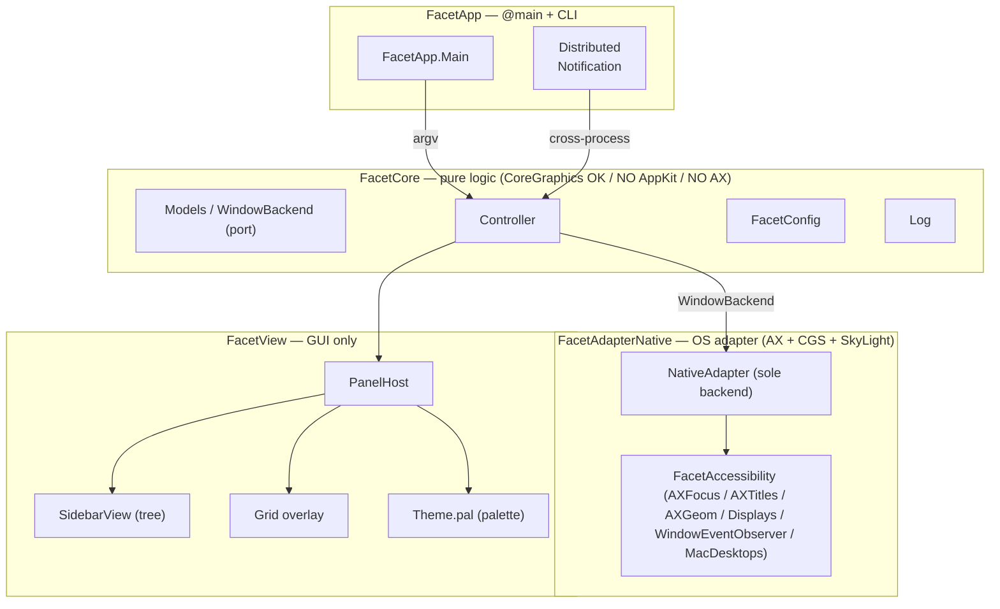

# 用語集 — facet のユビキタス言語

facet を構成する各パーツの **正規の呼び名** をまとめた規範ドキュメント。
**コード・ドキュメント・コミットメッセージ・PR タイトル・Claude Code への
プロンプト、すべてここに載っている名前のみを使う**。同義語は揺らぎを生む。
1 つに決めて、それで通す。

なお **正規名は英語のまま** 保持する。コード識別子・設定キー
（`FacetCore`, `WindowBackend`, `[desktop.N]`, `pal` など）と一対一に対応
させるため。日本語化するのは説明文だけ。

なお **似て紛れやすい 4 概念** は最優先で区別する（下の「4 つの中核概念」を
参照）。とくに **mac desktop**（OS の native Space）と **facet workspace**
（facet 独自の抽象）は語感が近く混同の温床なので、コード識別子・設定キー・
コメントすべてで綴り分ける。

用語が足りなければ、その用語を導入する PR で同時にこのファイルへ追記する。
用語名を変える場合は、コード・ドキュメント・このファイルを **同一 PR で**
書き換える。

> 各エントリの形式: **正規名**, 1〜2 行の定義, 設定 / コードでの所在,
> そして `Don't call it:` 行 — このエントリが置き換える誤った呼び名のリスト。

---

## アーキテクチャ全体像

facet は **ヘキサゴナル 3 層分割**（[docs/architecture.md](architecture.md)）。
下の図は層と主要な seam を示す。レイヤーをまたぐ型は常に protocol を介す。

---

## レイヤー / モジュール

### FacetCore
**純ロジック層**。CoreGraphics の値型は OK だが AppKit / AX / バックエンド型
は持ち込まない。XCTest で単体検証可能であることが層境界の根拠。
- 場所: [`Sources/FacetCore/`](../Sources/FacetCore/)
- 含むもの: `Models`, `WindowBackend` protocol, `Controller`, `FacetConfig`, `Log`
- **Don't call it:** domain layer, business logic, model layer, ドメイン層

### FacetAdapterNative
**唯一の backend adapter**（v2.0.0 で `rift` 廃止）。AX / CGS / SkyLight
プライベート API への入口。バックエンド固有の型は **この中に閉じ込める**。
- 場所: [`Sources/FacetAdapterNative/`](../Sources/FacetAdapterNative/)
- **Don't call it:** native backend, ax adapter, アダプタレイヤー（一般化したい時のみ）

### FacetAccessibility
M5 で抽出した **AX ヘルパ群**。`AXFocus`, `AXTitles`, `Focus.assert /
withRetry`, `AXGeom`, `Displays`, `WindowEventObserver`, `MacDesktops` がここに
住む。Phase ε 後の唯一の consumer は `FacetAdapterNative`。新規 AX コードは
backend 固有でない限りここへ。
- 場所: [`Sources/FacetAccessibility/`](../Sources/FacetAccessibility/)
- **Don't call it:** ax utils, accessibility helpers, AX ユーティリティ

### FacetView
**GUI 専用層**。View は `WindowBackend` protocol だけを見る。具体 adapter を
直接参照しない。
- 場所: [`Sources/FacetView/`](../Sources/FacetView/)
- **Don't call it:** ui layer, presentation layer, ビュー層

### WindowBackend (port)
Core と Adapter の間の **唯一の seam**（hexagonal port）。Controller / View
が見るのはこの protocol のみ。
- 定義: [`Sources/FacetCore/`](../Sources/FacetCore/) 内
- **Don't call it:** adapter protocol, backend interface, バックエンド契約

---

## ドメインモデル

### 4 つの中核概念（最優先で区別する）

似た語が複数の意味で流通していた歴史があるため、まずこの 4 つを綴り分ける。

| 正規名 | 意味 | コード / 設定での所在 |
|---|---|---|
| **mac desktop** | macOS の native Space（OS の仮想デスクトップ。Mission Control の "Desktop N"） | `MacDesktops`, `activeMacDesktopID`, `[desktop.N]` |
| **facet workspace** | facet 独自の window グループ抽象（1 mac desktop に N 個） | `WorkspaceCatalog`, `workspaces()` |
| **facet view** | ユーザー向け UI surface の種類（`tree` / `grid` / `rail`） | `--view=NAME`, `FacetView*`, `canonicalViews` |
| **lens** | tag モードで「今見えているタグ集合」（M11-3・未実装） | 予約語（現状コードに実体なし） |

**mac desktop ↔ facet workspace は最重要の混同ポイント**。OS のデスクトップ
（mac desktop）と facet の抽象（facet workspace）は別物で、1 mac desktop が
複数の facet workspace を抱える（[[per-mac-desktop workspaces]]）。M11-2 で
両者を 1:1 にする予定だが、それは**実装上の関係**であって、概念としては
区別し続ける。**facet view ↔ lens** も直交軸（"どう見せるか" × "どのタグ集合
を見るか"）として分ける。

### mac desktop
macOS の **native Space**（OS が提供する仮想デスクトップ。Mission Control が
"Desktop 1" / "Desktop 2" … と表示するもの）。facet はこれを **read-only** に
しか触らない（別 mac desktop への window 移動は SIP-off が要るので非対応）。
- コード: `MacDesktops`（in `FacetAccessibility`・SkyLight 経由の read-only
  クエリ）, `NativeAdapter.activeMacDesktopID`
- 設定: `[desktop.N]` キー（Mission Control 順の ordinal で指定）
- UI: tree の上部ハンドル帯に "Desktop N"（macOS の呼称に合わせた表示ラベル）
- **Don't call it:** Space, native Space, workspace, virtual desktop（facet
  workspace と紛れる）, デスクトップ別
  - ※ Apple の API 名（`SLSGetActiveSpace`, `NSWorkspace.activeSpaceDidChange`,
    SLS の `"Spaces"` dict キー等）は Apple の語のまま残す。"mac desktop" に
    綴り替えるのは facet 自身の surface だけ。

### facet workspace
**facet が定義する Window 集合**。タブのようにグループ化された window 群を
1 まとまりとして扱う単位。1 つの [[mac desktop]] が複数の facet workspace を
持つ。
- コード: `WorkspaceCatalog` / `workspaces()`
- **Don't call it:** group, tab, page, desktop, mac desktop, Space, グループ, タブ

### per-mac-desktop workspaces
各 [[mac desktop]]（native Space）ごとに **独立した `WorkspaceCatalog`** を
持つ機能。`NativeAdapter` は active な mac desktop id でカタログを park / swap
する。SkyLight は **read-only** 利用（書き込みは SIP-off 必要）。SkyLight
未利用環境では `activeMacDesktopID == 0` で 1 つの shared catalog に縮退
（pre-feature 挙動）。
- 設定: `[desktop.N]` キー（ordinal で指定）
- コード: `MacDesktops`（in `FacetAccessibility`）, `FacetConfig.isMacDesktopManaged`
- **Don't call it:** per-native-Space workspaces（コメント / メモリでは旧称が
  残る）, virtual desktop workspace, multi-desktop, デスクトップ別

### facet view
ユーザー向け UI surface の種類。`tree` / `grid` / `rail` が正規名（`canonicalViews`）。
新規 view 追加時は `Main.canonicalViews` + `Controller.dispatchView/Hide/Toggle`
の case を増やすだけで済むよう **per-view 専用フラグを作らない**。`--view`
（どう見せるか）は [[lens]]（どのタグ集合を見るか）と直交する別軸。
- CLI: `--view=NAME` / `--hide=NAME` / `--toggle=NAME`
- **Don't call it:** mode, panel, window, lens（lens は表示中タグ集合の別概念）,
  モード, ペイン

### lens
tag モードで **「今見えているタグ集合」**（dwm の tagset 相当）。`facet view`
が "どう見せるか" なのに対し lens は "どのタグ集合を見るか"＝直交する別軸。
**M11-3 (tag モデル) で実装予定で、現状コードに実体は無い**（用語の場所取りと
してここに先行登録）。memory `[[facet-tag-model-decisions]]`。
- 想定 CLI: `facet lens --only=NAME / --toggle=NAME / --all`（未実装）
- **Don't call it:** view（facet view は UI surface の別概念）, tagset, filter,
  タグビュー

### tree view
左サイドバーに表示する **[[facet workspace]] の階層リスト**。`SidebarView` がレンダリング。
- コード: `SidebarView`
- **Don't call it:** sidebar, outline, list, サイドバー（描画される場所を指す時のみ別）

### grid view
全画面の **window グリッド overlay**。`--view=grid` で起動。常に key/active
（construction 上）なので `--active` 修飾子は無視される。
- **Don't call it:** mosaic, overview, expose, モザイク, グリッド表示

### rail view
全画面の **[[facet workspace]] overview**（Mission Control 風）。`--view=rail` で召喚。
中央 HERO に active workspace を大表示、画面下部に全 WS を window サムネのミニ画面で
1 列に並べる。←/→ で browse・クリックで切替・window を WS 間 drag / header drag で swap。
tree / grid とは役割が違う（速い切替・俯瞰）。既定 view にはできない（`effectiveDefaultView`
は tree / grid のみ受理）。#109 で shipped。
- コード: `RailView`（`FacetViewRail`）
- **Don't call it:** switcher, expose, mission control, スイッチャー, ミッションコントロール

### AX target
**現在 facet が操作対象とする window**。`Window.title` は backend だけで
埋まるとは限らず、`AXTitles.resolve` が `kAXTitle` を short-TTL で解決する
（memory `[[window-titles-AX-resolved]]`）。
- コード: `AXTitles` / `AXFocus`
- **Don't call it:** focused window, active window, frontmost window,
  target app, フォーカスウィンドウ, アクティブウィンドウ

### BSP tiling / stack tiling
γ Phase で導入された 2 種の tiling layout。`facet workspace --layout=NAME`
で切替。AX role が `dialog` / `sheet` / `palette` の window は **auto-float**
（tiling 対象外）。
- CLI: `--layout=NAME` / `--retile`, `facet window --toggle-float` /
  `--toggle-orientation` / `--cycle-stack=next|prev`
- **Don't call it:** auto layout, window split, ウィンドウ分割

### sticky window
1 つの window を **現在の mac desktop 内・全 facet workspace のメンバー**
にして出っぱなしにする（PiP / タイマー / チャット / 音楽）。実装は既存
anchor park の再利用 2 点だけ:（1）**park 免除** — `shouldParkAnchor` が
sticky id に false を返し、WS 切替で anchor sliver へ流されない、（2）**強制
floating** — `floatingWindows` にも入れて tiling に参加させない（WS ごとに
reflow する tiled 窓が同時に「出っぱなし」はできないため）。集合は
`WorkspaceCatalog.everywhereWindows`。解除すると **今いる workspace の通常
タイル窓**に着地（元 home WS には戻さない＝目の前の窓が消えない POLA）。
mac desktop 跨ぎは対象外（READ-only SkyLight・macOS の「すべてのデスク
トップ」任せ）。session 限り・per-mac-desktop・`marks` と直交。
- CLI: `facet window --toggle-sticky`（`--toggle-float` で OFF にしても同じ
  着地＝float-exit = sticky-exit）。`facet status` に `N sticky`、tree に
  **枠線無しの 📌 絵文字バッジ**（pill 描画ではなく glyph のみ）。
- UI: tree の右クリック / `m`（--active）コンテキストメニューに **"Sticky"**
  （非 sticky 窓）/ **"Unstick"**（sticky 窓）項目。sticky 窓は floating で
  float-exit=sticky-exit ゆえ "Unfloat" は出さず "Unstick" 一本に集約。
- **Don't call it:** always-on-top, pin, float, 常駐ウィンドウ, scratchpad
  （scratchpad は「名前付きの隠し棚から今の WS に呼ぶ」別機能）

### scratchpad
**名前付きの隠し棚**。既存 window を登録すると即 anchor park で隠れ、必要な時
に **今いる workspace へフロート overlay として呼ぶ**（ドロップダウン端末 /
メモ用途）。`sticky` が「全 WS に出っぱなし」なのに対し scratchpad は「普段は
隠れていて呼んだ WS にだけ出る」＝役割が被らない。実装は park + floating +
名前付きマップの再利用:`WorkspaceCatalog.scratchpads`（`[名前: WindowID]`
1:1 双射・`marks` と同型）+ `stashedWindows`（隠れ中＝棚に居る集合）。
- **stash / summon / settle / release** … `--stash=NAME`＝即 park（強制
  floating + 棚へ）。`--toggle=NAME`＝**今の WS で見えていれば棚に戻す / 見え
  ていなければ今の WS に呼ぶ**（別 WS に居着いた窓を引っ張るのも同じ操作）。
  呼んだ窓は **居着く**（普通の floating 窓として WS 切替で park/restore・棚
  に戻すのは見えてる時に toggle した時だけ）。`--release=NAME`＝棚から外して
  今の WS の通常タイル窓にする（`sticky` 解除と同じ着地・POLA）。
- 表示制御の肝: 隠れ中（stashed）の窓は **snapshot から除外**＝tree にも window
  count にも出ず、`facet status` の `stashed:` 行にだけ名前が出る。居着き
  （settled）の窓は tree に `scratchpad:NAME` の **dim 枠線 pill バッジ**。
  WS 切替で stashed 窓を絶対 restore しないよう `setActive` の park/restore
  リストと `resyncVisibleState` で `isStashed` を明示スキップ（`sticky` の
  park 免除の鏡像）。
- spawn なし（既存窓の出し入れのみ・launcher 化しない＝rules engine 領域は
  scope 外）。`sticky` と排他（一方を立てると他方解除）/ `marks` と直交 /
  float-exit = scratchpad-exit（`--toggle-float` で release）/ 窓 close で
  `forgetWindow` が自動 prune / session 限り・per-mac-desktop。
- CLI: `facet scratchpad --stash=NAME / --toggle=NAME / --release=NAME`
  （`window` でも `workspace` でもない**新 subject**＝名前付きスロットを扱う
  ため）。
- **Don't call it:** 隠し窓, hidden window, stash（git の stash ではない）,
  sticky（sticky は「全 WS に出っぱなし」別機能）, launcher（起動はしない）

### real-window DnD (枠C)
実 window を mouse で直接掴んで active workspace の tile 内を再配置する操作
（PR-1 = backend / PR-2 = UI / PR-3 = prediction overlay）。検知は Controller の
**global NSEvent monitor**（観測のみ・facet 自身の programmatic move は mouse-down
が無いので自然に除外）。対象は tile 可視 window のみ（**float 除外**）。
- **intent zone** … drag 中、対象 window 上のカーソル位置を分類する純粋幾何
  ([Sources/FacetCore/IntentZone.swift](../Sources/FacetCore/IntentZone.swift))。
  中央矩形（面積 ~40%）= **swap** / 四隅対角線の三角ウェッジ 4 辺 = **insert**。
- **swap / insert** … backend verb 2 種（`WindowBackend.swapWindows` /
  `insertWindow(_:beside:edge:)`）。stateless / stack は window order、bsp は
  `LayoutTree` を変換。**CLI には出さない**（DnD 専用 op）。
- **InsertEdge** … insert 先の辺（`left` / `right` / `top` / `bottom`）。
  layout が解釈（bsp = その辺で分割 / stateless = order の前後）。
- **prediction overlay** … drag 中、ドロップ後レイアウトを HazeOver 風に提示
  ([Sources/FacetView/DndPredictionOverlay.swift](../Sources/FacetView/DndPredictionOverlay.swift))。
  暗幕で全体を沈め、**動く window だけ**スポットライト（accent 実線 = 掴み窓 /
  accent2 破線 = 玉突きで動く窓）。frames は `WindowBackend.predictedDrop`
  （commit と同じ計算 → ズレ無し）。
- **resize（機能2・縁ドラッグ）** … window の縁を掴んでリサイズ→隣接連動。
  FOLLOW モデル（掴んだ window は OS native resize・facet は ratio 更新 +
  反対側を連動）。`WindowBackend.resizeWindow(_:to:)` が「掴んだ window の新
  frame → **controlling split**（その辺を仕切る最近接祖先 split・yabai
  `window_node_fence` 流）の ratio」を更新（bsp）/ master 仕切り（tall/wide/
  centered の `masterRatio`）。PR-1 = 土台 backend のみ。
- **Don't call it:** window warp, snap zone, drop zone, ドラッグ移動

### loading skeleton
mac desktop 切替時の flicker を隠す **CLI-triggered な skeleton 表示**。
`facet --view=tree --loading[=MS]` を **switch キー押下より前に** 外部から
発火させる（macOS は pre-mac-desktop-switch hook を出さないため auto trigger 不可）。
- コード: `Controller.showLoading` → `SidebarView` の skeleton
- **Don't call it:** placeholder, loader, spinner, ローディング表示

---

## CLI / IPC

### DNC (Distributed Notification)
プロセス間 IPC の通り道。`facet --view=tree` のような CLI 呼び出しは
`com.facet.app` 宛の Distributed Notification として届く。
- **Don't call it:** ipc message, event, distributed event, IPC イベント

### `--active` modifier
view を出す動作の **修飾子**（verb ではない）。`--view=tree` と組合せた時のみ
意味を持ち、key focus を即時奪う（+ activation policy フリップ）。[[grid view]]
では無視。
- **Don't call it:** focus flag, activate flag, アクティブフラグ

### typo rejection
未知の view / theme 名は `exit 2` + stderr で **明示エラー**。silent fallback
は意図的に出さない。
- 反例: TOML キーの値は **clamp**（typo 起こしても layout が壊れない方針）
- **Don't call it:** strict mode, fail-fast, 厳密モード

---

## 設定 / Theme

### `config.toml`
リポジトリルートの `config.toml` が **source-of-truth テンプレート**。
ユーザーは `curl` して `~/.config/facet/config.toml` に置く。app は読むだけ
（書かない / 自動生成しない / 永続化しない）。memory `[[config-default-behavior]]`。
- **Don't call it:** settings, preferences, user config, 設定ファイル（一般指示語）

### effective accessors
`FacetConfig` の `effective*` プロパティ。out-of-range / unknown 値を
**default に clamp** して返す。raw Optional は読まずに必ずこちらを通す。
- **Don't call it:** safe getters, validated accessors, バリデート getter

### `pal` (palette)
`Sources/FacetView/Theme.swift` の **`@MainActor` module-level var**。
view ファイルが `pal.text` / `pal.dim` などを直接参照する。**改名しない**
（view 側 ~数百箇所の変更を引き起こすが behavior 利得ゼロ）。
- preset: `.terminal` / `.cute` / `.system`（`NSColor` が Sendable でない
  ため `@MainActor`）
- **Don't call it:** theme.current, currentPalette, theme, テーマ

---

## ログ / 観測

### `Log.line`
**常時 ON** のログ関数。end-user 向けの operational event（AX focus
mismatch 等）を出す用途。
- **Don't call it:** info log, always-on log, 通常ログ

### `Log.debug`
**`debugMode` global で gate**（`FACET_DEBUG` 環境変数の設定時のみ）。
Controller / Adapter / EventSource の hot path で気軽に使う。
- 出力先: `/tmp/facet.log` 常時 + `FACET_DEBUG` 時のみ stderr ミラー
- **Don't call it:** verbose log, trace log, 詳細ログ

### `FlippedClipView`
day-one から使う `NSClipView` 派生。非 flipped を使うと grip-drag が
散発的に失敗する（memory `[[grid-branch-grip-intermittent]]`）。**初日から
全 scroll view に投入**。
- **Don't call it:** custom clip view, fixed clip view, クリップビュー

### drag-state lifecycle
drag 状態は **backend round-trip 完了で clear**（`mouseUp` で clear しない）。
- **Don't call it:** mouse drag flag, drag state, ドラッグ状態（一般語として
  はあえて避ける）

---

## バンドル / 配布

### bundle id `com.facet.app`
TCC grant と self-signed cert identity の鍵。**変えない**（M2 で確定）。
- 設定: [`package.sh`](../package.sh)
- **Don't call it:** app identifier, app id, バンドル ID

### sole backend (`rift` 廃止)
v2.0.0 で旧 `rift` adapter を retire し、`FacetAdapterNative` が唯一の
backend に。Phase ε で完了。新規 adapter を足す場合も view 側変更不要
（`WindowBackend` port 経由のため）。
- **Don't call it:** legacy backend, primary backend, メイン backend

---

## エントリ追加時のルール

- 1 つの概念につき正規名は 1 つ。複数の呼び方が流通しているなら、
  このファイルで勝者を選び、敗者は `Don't call it:` 行に並べる。
- 正規名は **英語のまま** 書く。コード識別子（`FacetCore`, `pal`,
  `[desktop.N]`）はその表記を維持する。
- 定義は **1〜2 文** に収める。動作の詳細は設定セクションやソース
  ファイルへリンクし、ここで説明し直さない。
- 用語が CLI surface / DNC / config に表面化する場合は CLI フラグ名を
  必ず併記する。
