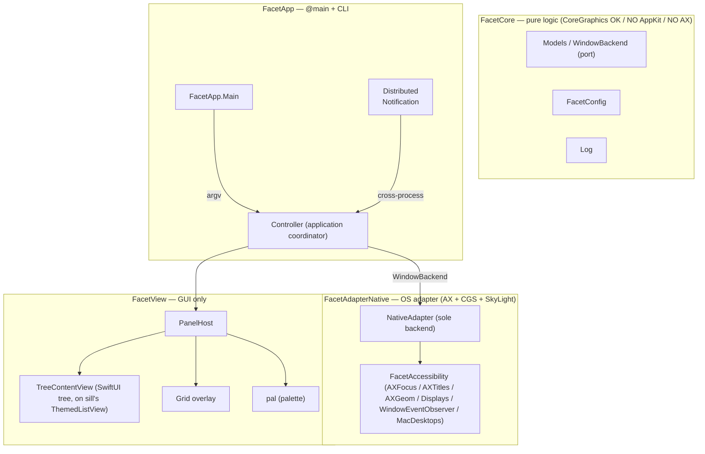

# Glossary — facet's ubiquitous language

The normative document collecting the **canonical names** of every part of
facet. **Code, documentation, commit messages, PR titles, and prompts to
Claude Code use only the names listed here.** Synonyms breed drift: pick one
name, use it everywhere.

Canonical names stay **in English**, 1:1 with code identifiers and config
keys (`FacetCore`, `WindowBackend`, `[[desktop.N.section]]`, `pal`, …).

The **5 easily-confused core concepts** are distinguished before anything
else (see "The 5 core concepts" below). In particular **mac desktop** (the
OS's native Space) and **facet workspace** (facet's own abstraction) sound
alike and are a breeding ground for confusion, so code identifiers, config
keys, and comments all spell them apart. The hierarchy is **mac desktop >
[[section]] > window**, plus **[[facet workspace]]** (each section's spatial
cell) and **[[isolate desktop]]** (the always-on match-driven desktop of
`[desktop.N] type=isolate`). **isolate is a desktop type, not a section**
(the old section-lens retired in t-ec9s; the older name `lens` retired in
t-mqqw).

When a term is missing, add it to this file in the same PR that introduces
it. When renaming a term, rewrite code, docs, and this file **in one PR**.

> Entry format: **canonical name**, a 1-2 line definition, where it lives in
> config / code, and a `Don't call it:` line — the list of wrong names this
> entry replaces.

---

## Architecture overview

facet is a **hexagonal 3-layer split**
([docs/architecture.md](architecture.md)). The diagram below shows the
layers and the main seams. Types crossing a layer always go through a
protocol.

```mermaid
flowchart TB
  subgraph CORE["FacetCore — pure logic (CoreGraphics OK / NO AppKit / NO AX)"]
    MODELS["Models / WindowBackend (port)"]
    CONFIG["FacetConfig"]
    LOG["Log"]
  end
  subgraph ADAPTER["FacetAdapterNative — OS adapter (AX + CGS + SkyLight)"]
    NATIVE["NativeAdapter (sole backend)"]
    AXHELPERS["FacetAccessibility (AXFocus / AXTitles / AXGeom / Displays / WindowEventObserver / MacDesktops)"]
  end
  subgraph VIEW["FacetView — GUI only"]
    PANELHOST["PanelHost"]
    SIDEBAR["TreeContentView (SwiftUI tree, on sill's ThemedListView)"]
    GRID["Grid overlay"]
    THEME["pal (palette)"]
  end
  subgraph APP["FacetApp — @main + CLI"]
    MAIN["FacetApp.Main"]
    CTRL["Controller (application coordinator)"]
    DNC["Distributed<br/>Notification"]
  end
  MAIN -->|argv| CTRL
  DNC -->|cross-process| CTRL
  CTRL -->|WindowBackend| NATIVE
  NATIVE --> AXHELPERS
  CTRL --> PANELHOST
  PANELHOST --> SIDEBAR
  PANELHOST --> GRID
  PANELHOST --> THEME
```

---

## Layers / modules

### FacetCore
The **pure-logic layer**. CoreGraphics value types are OK; AppKit / AX /
backend types never enter. Being unit-testable under XCTest is the rationale
for the layer boundary.
- Location: [`Sources/FacetCore/`](../Sources/FacetCore/)
- Contains: `Models`, the `WindowBackend` protocol, `FacetConfig`, `Log`
  (`Controller` is the AppKit-dependent application coordinator, so it lives
  in [[FacetApp]] — matching architecture.md's Application layer)
- **Don't call it:** domain layer, business logic, model layer

### FacetAdapterNative
The **sole backend adapter for window management** (`rift` retired in
v2.0.0; image capture is the separate axis [[FacetCapture]]). The doorway to
the AX / CGS / SkyLight private APIs. Implements [[WindowBackend]].
Backend-specific types are **confined inside**.
- Location: [`Sources/FacetAdapterNative/`](../Sources/FacetAdapterNative/)
- **Don't call it:** native backend, ax adapter

### FacetCapture
The **image-capture adapter** (P7). The sole consumer of
`ScreenCaptureKit`, implementing FacetCore's [[WindowCapturing]] port
(`SCKWindowCapture`). A backend on a different axis from window management
(AX/CGS), so it stays an independent module rather than folding into
[[FacetAdapterNative]]. `FacetView` never imports a capture backend.
- Location: [`Sources/FacetCapture/`](../Sources/FacetCapture/)
- **Don't call it:** preview module, screenshot adapter, WindowPreview (the
  old FacetView type name — renamed and moved in P7)

### FacetAccessibility
The **AX helper family** extracted in M5. `AXFocus`, `AXTitles`,
`Focus.assert / withRetry`, `AXGeom`, `Displays`, `WindowEventObserver`, and
`MacDesktops` live here. Since Phase ε its sole consumer is
`FacetAdapterNative`. New AX code goes here unless backend-specific.
- Location: [`Sources/FacetAccessibility/`](../Sources/FacetAccessibility/)
- **Don't call it:** ax utils, accessibility helpers

### FacetView
The **GUI-only layer**. Views see only the `WindowBackend` protocol — never
a concrete adapter.
- Location: [`Sources/FacetView/`](../Sources/FacetView/)
- **Don't call it:** ui layer, presentation layer

### WindowBackend (port)
The seam (hexagonal port) between Core and the **window-management
adapter**. Abstracts workspaces / move / focus / switch / layout / display /
the event stream. Controller / View see only this protocol. Capture is a
separate port ([[WindowCapturing]]).
- Defined in: [`Sources/FacetCore/`](../Sources/FacetCore/)
- **Don't call it:** adapter protocol, backend interface

### WindowCapturing (port)
The seam (hexagonal port, P7) between Core and the **capture adapter**.
Abstracts per-window image capture (overview thumbnails + tree hover
preview). Orthogonal to [[WindowBackend]] (fetching drawing assets, not
managing windows). Returns `CGImage` (FacetCore is AppKit-free) = the view
side wraps it in `NSImage`. Sole implementation:
[[FacetCapture]]'s `SCKWindowCapture` (ScreenCaptureKit).
- Defined in: [`Sources/FacetCore/WindowCapturing.swift`](../Sources/FacetCore/WindowCapturing.swift)
- **Don't call it:** preview protocol, screenshot interface, WindowPreview
  (the old type name)

---

## Domain model

### The 5 core concepts (distinguish these first)

Similar words have historically circulated with different meanings, so spell
these five apart before anything else.

| Canonical name | Meaning | Where in code / config |
|---|---|---|
| **mac desktop** | macOS's native Space (the OS virtual desktop; Mission Control's "Desktop N"). **Typed** (`workspace` / `isolate`) | `MacDesktops`, `activeMacDesktopID`, `[desktop.N]` / `[[desktop.N.section]]` |
| **section** | the **ordered display unit** config declares (the tree's ordering) = each [[facet workspace]]'s spatial cell | `DesktopSection`, `ProjectedSection`, `FilterProjection` |
| **window** | an individual OS window facet manages (title resolved via AX) | `Window`, `WindowSlot`, `AXTitles` |
| **facet workspace** | facet's own window-group abstraction (N per mac desktop) | `WorkspaceCatalog`, `workspaces()` |
| **isolate desktop** | the **always-on filtered mac desktop** of `[desktop.N] type=isolate`: tiles the `match`ing windows via `layout` and parks the rest (tree-only). **The old name `lens` retired in t-mqqw** | `desktopType`, `desktopIsolate`, `applyIsolatePark` |

**mac desktop ↔ facet workspace is the top confusion hazard.** The OS
desktop (mac desktop) and facet's abstraction (facet workspace) are
different things; one mac desktop holds several facet workspaces
([[per-mac-desktop workspaces]]). M11-2 plans to make them 1:1, but that is
an **implementation relationship** — conceptually they stay distinct.
**facet workspace ↔ [[isolate desktop]]** are also distinct (the former is a
spatial cell that arranges windows; the latter a typed mac desktop that
filters them). **facet view** (`tree`/`grid`/`rail`) is the orthogonal
"how to show" axis, a different layer from the 5 concepts above (what /
where).

### mac desktop
macOS's **native Space** (the OS-provided virtual desktop — what Mission
Control labels "Desktop 1" / "Desktop 2" …). facet touches it **read-only**
(moving a window to another mac desktop needs SIP-off, so it is
unsupported).
- Code: `MacDesktops` (in `FacetAccessibility` — read-only queries via
  SkyLight), `NativeAdapter.activeMacDesktopID`
- Config: `[[desktop.N.section]]` / `[desktop.N]` (typed desktop —
  [[isolate desktop]]) blocks, addressed by Mission Control ordinal
- UI: the tree's top handle band shows "Desktop N" (display label matching
  macOS's own wording)
- **Don't call it:** Space, native Space, workspace, virtual desktop
  (confusable with facet workspace)
  - ※ Apple API names (`SLSGetActiveSpace`,
    `NSWorkspace.activeSpaceDidChange`, SLS's `"Spaces"` dict key, …) keep
    Apple's word. Only facet's own surfaces respell to "mac desktop".

### facet workspace
A **facet-defined set of windows** — a tab-like grouped unit of windows.
One [[mac desktop]] holds several facet workspaces. **A workspace can be
config-named with any `label`** (§A — the old by-name seed of `[desktop.N]`
is gone). **Unnamed ones (empty label) display as a 1-based index** (§B —
the emoji auto-naming pool `WorkspaceNaming` retired). Renaming also works
at runtime via `facet workspace --rename` (session-only). A workspace is
the spatial slot = meaning is carried by [[section]] / tag.
- Code: `WorkspaceCatalog` / `workspaces()` /
  `FacetConfig.effectiveWorkspaceList` (with sections active: non-empty
  `label` becomes the name; empty = anonymous slot) / display via
  `sectionDisplayLabel(index:label:)` (§D — `index` or `index (label)`)
- **Don't call it:** group, tab, page, desktop, mac desktop, Space

### isolate desktop
A [[mac desktop]] typed by `[desktop.N] type = "isolate"` = an **always-on
match-driven desktop**. The hierarchy is **mac desktop > section > window**
(the old **board** layer retired in t-0sbm — "I want both workspaces and
isolate" is solved by **typing the mac desktops**, not by boards: 1 ordinal
= 1 desktop = 1 type). `[desktop.N]` is a SINGLE table; `type` is
`workspace` (the classic form — `[[desktop.N.section]]` describes the
content; writing only sections implies this type) or `isolate`.
- **Behavior**: for as long as you are on that mac desktop, windows matching
  `match` are tiled via `layout` and the rest are anchor-parked in a corner
  (sticky is exempt; the sets derive from `match` on every reconcile). There
  is no focus toggle — **entering the desktop IS the focus**. Flat = no
  sub-workspaces (`effectiveWorkspaceList` seeds exactly one N=1 slot). It
  **moves real windows** (a park does not undo when you leave) — which is
  why the old name `lens` was a lie (below). What the tree shows is decided
  by `show-non-matching` (`true` also lists parked non-matching windows in a
  **holding** section, making a full-window inventory).
- **Tree-only** (the two-world split): membership is dynamic with no fixed
  screen → no thumbnails. `--view grid` / `--view rail` are a **loud
  reject** on that desktop (`IsolateDesktopGate`). With
  `show-non-matching = true` the tree shows 2 sections — **matched** +
  **holding** (non-matching); default false = 1 matched section.
- Config: `[desktop.N]` (a SINGLE table, not an `[[…]]` array): `type`
  required; `isolate` requires `match`, with optional `layout`,
  `show-non-matching`, `label`
- Code: `DesktopType.isolate` / `DesktopMeta` / `FacetConfig.desktopType` /
  `desktopIsolate` / `FilterProjection.projectIsolateDesktop` (1|2-section
  composition, pure) / `NativeAdapter.applyIsolatePark` (always-on park +
  layout seam) / `WorkspaceCatalog.isolateParked` / `IsolatePark.parkSet`
  (pure) / `IsolateDesktopGate`
- **🪦 the old name `lens` (retired in t-mqqw)**: the optical metaphor's
  whole content is "look without touching", but this desktop **tiles real
  windows, parks them, and keeps the park after you leave**.
  `type = "lens"` is a **loud reject** (no alias; `DesktopMeta.parse`
  answers by name that "it was never a view"). Unprompted, the code had
  already converged on `IsolatePark` / `isolateParked` / `facet query`'s
  `parked` — the config word caught up with it.
- **Don't call it:** lens (🪦 retired), board (the old concept — retired in
  t-0sbm), tab, focus mode, filtered space, saved filter

### 🪦 orphan — retired (t-6rbc)
Was the concept of **a window belonging to NO [[facet workspace]]**
(`WindowSlot.workspace == nil`). **A dead word.** **facet could never
create an orphan** — the only producer `setOrphan`'s only caller
`orphanWindow` had had **zero callers** since t-qtpx removed ws→lens DnD.
So the orphan set was **provably empty for two releases**, six modules
carried plumbing for it, and the tree kept drawing a **permanently empty
section** (the [[unassigned]] receptacle) — the same defect class as
[[isolate desktop]]'s old name `lens` being a lie (a UI claiming to hold
what it does not).

**"Every window lives in exactly one workspace" is now a type**:
`WindowSlot.workspace: Int` (not Optional). The adopt path (`reconcile` →
`WindowSlot(workspace: activeIndex)`) always assigned a workspace from the
start.
- Removed: `setOrphan` / `orphanWindow` / `orphanWindows` / the `Int?` of
  `WindowSlot.workspace` / `ProjectedSectionType.unassigned` / the §G
  receptacle / `GridPick.unassigned` / `RailPick.unassigned` /
  `OverviewCell.isReceptacle` / `facet query`'s `"Orphans"` line
- **`unassigned` is a retired key** (see [[unassigned]]) = silently deleting
  it would **promote** the section to a workspace cell and change the
  layout, so the whole line is a **loud drop**
- **Don't call it:** lost window, homeless — it does not exist at all

### per-mac-desktop workspaces
Each [[mac desktop]] (native Space) holds an **independent
`WorkspaceCatalog`**. `NativeAdapter` parks / swaps catalogs by the active
mac desktop id. SkyLight is used **read-only** (writes need SIP-off). Where
SkyLight is unavailable, `activeMacDesktopID == 0` degrades to one shared
catalog (the pre-feature behavior). **Opt-in management fires when a
`[[desktop.N.section]]` or `[desktop.N]` block exists.** With even one
[[section]] present, the section model activates and decides that desktop's
workspace count + each layout (a [[mac desktop]] without sections degrades
to the default 5 workspaces).
- Config: `[[desktop.N.section]]` ([[section]], addressed by ordinal)
- Code: `MacDesktops` (in `FacetAccessibility`),
  `FacetConfig.isMacDesktopManaged` / `FacetConfig.isSectionModelActive`
  (the gate for section-model activation)
- **Don't call it:** per-native-Space workspaces (the old name survives in
  comments / memory), virtual desktop workspace, multi-desktop

### facet view
The kinds of user-facing UI surface. `tree` / `grid` / `rail` are the
canonical names (`canonicalViews`). Adding a view must only require new
cases in `Main.canonicalViews` + `Controller.dispatchView/Hide/Toggle` — 
**no per-view dedicated flags**. `--view` (how to show) is orthogonal to
[[facet workspace]] / [[tag]] / [[isolate desktop]] (what to show).
- CLI: `--view NAME` / `--hide NAME` / `--toggle NAME`
- **Don't call it:** mode, panel, window, lens (🪦 retired — see
  [[isolate desktop]])

### tree view
The **hierarchical list of [[facet workspace]]s** shown in the left
sidebar. Rendered in SwiftUI on sill's `ThemedListView` since #448.
- Code: `TreeContentView` / `TreeViewModel` (`FacetViewTree`), hosted by
  `PanelHost` (`FacetApp`). `SidebarView` survives only as state holder
  (`searching` / `kbNav` / `isSkeleton`) — no longer the render surface
  (full retirement = t-67th)
- **Don't call it:** sidebar, outline, list

### grid view
The full-screen **window grid overlay**. Summoned with `--view grid`.
Always key/active (by construction).
- **Don't call it:** mosaic, overview, expose

### rail view
The full-screen **[[facet workspace]] overview** (Mission Control-like)
with an **active-centered carousel switcher** (2-b). Summoned with
`--view rail`. The central HERO shows the previewed WS large; one of the
screen's **[[edge]]s** carries a one-row strip of WS window-thumbnail
mini-screens, with **active pinned to the strip center** and neighbors
cyclically placed. Arrows along the strip axis **rotate the strip** (center
= selection / preview only — the hero follows); Return/click switches and
closes; Esc closes; windows drag between WSs / header-drag swaps. When WSs
exceed `[rail] cells`, cells never shrink — the strip **rotates** (peek at
both ends signals "there's more"). A different role from tree / grid (fast
switching + bird's-eye). Never auto-shows at launch (facet always starts
agent-only; every view is summoned). #109 shipped → M9-3/M9-4 made it
edge-based → **2-b made it a carousel (replacing M9-4's scroll)**.
- Code: `RailContentView` / `RailViewModel` (`FacetViewRail`, SwiftUI
  since #457) / `railBands` / `railCarouselOffsets` (`FacetCore`, pure
  geometry)
- **Don't call it:** switcher, expose, mission control, scroll bar

### overview surface
**The umbrella axis shared by grid view and rail view: a full-screen
overlay tiled with [[facet workspace]] mini-screens + window thumbnails**
(tree view is excluded — a hierarchical list with no mini-screens). Since
the SwiftUI migration (grid #456, rail #457) each view is an @Observable
view model (`GridViewModel` / `RailViewModel`) driven by the Controller's
local monitors; what they share is the landing-gate value types
(`OverviewPendingDrop` / `OverviewPendingSwap`), slot cycling
(`cycleSlotIndex`), pure geometry (`OverviewGeometry`), the sill
WindowShell + `ShellFade` shell, the `snapshotRegion` zoom/crossfade hook,
and the Controller's move/swap round-trips + thumbnail capture feeds
(`Controller+Overview`). What genuinely differs (grid's `cols×rows` + FLIP
↔ rail's carousel + hero + edge, the `onPick` shape, arrow nav, scroll
rotation) stays per-view. Using "overview" alone for grid view is
forbidden (see grid view) — the umbrella is always "overview surface".
- Code: `Overview*` (value types / geometry = `FacetCore`; the shells and
  feeds = `Controller+Grid` / `Controller+Rail` / `Controller+Overview`)
- **Don't call it:** expose, mission control (visual metaphors for the
  individual views), grid (grid view's own word)

### edge
The **screen side** the rail's strip docks to (`top` / `bottom` / `left` /
`right`). Set per-invocation via `--view rail --edge NAME` or as the
default via config `[rail] edge`. A CLI typo is a **loud exit 2**; a config
typo is a **silent clamp→bottom** (the same asymmetric policy as
[[facet view]] / theme). Top/bottom = horizontal strip (←/→ browse);
left/right = vertical strip (↑/↓ browse). `RailEdge.axis` returns this
axis. Introduced in M9-3.
- Code: `RailEdge` (`FacetCore`) / `canonicalEdges`/`canonicalEdge`
  (`FacetApp`)
- **Don't call it:** side, anchor, position, dock (in any non-edge sense)

### strip
The band in [[rail view]] lining up [[facet workspace]] window-thumbnail
mini-screens along an [[edge]]. Thumbnails **justify** (scale up) to fill
the row with a constant gap between cells. Its size cap is `[rail] strip`
(% of the screen's short side — `stripPercent`); [[hero]] takes the rest.
The simultaneous-display cap is `[rail] cells`. It is also the literal
config key name `[rail] strip` (the band concept and the key share the
name).
- Code: `railLayout` (`RailMath`)'s `stripRect` / `railBands` (strip/hero
  split) / `railScaledPads` (short-side-based padding)
- See: [[hero]] / [[carousel]] / [[edge]] / [[rail view]]
- **Don't call it:** bar, dock, filmstrip, tray, [[sliver]] (a sliver is
  the residue after anchor park = a different concept)

### hero
The large central **preview of the section under preview (strip center)**
in [[rail view]]. A mini-screen shrunk at the real screen's aspect ratio,
filling whatever the [[strip]] does not occupy (the flip side of
`[rail] strip`%). When the strip's rotation ([[carousel]]) changes the
central [[facet workspace]], the hero follows.
- Code: `RailLayout.heroRect` (`RailMath`) / `railBands` (the hero region)
- See: [[strip]] / [[carousel]] / [[rail view]]
- **Don't call it:** preview, main, focus, big cell, spotlight

### carousel
How [[rail view]]'s [[strip]] arranges cells (2-b). **Active (= selection)
is pinned to the strip center**, the rest placed **cyclically** fore and
aft. Arrows along the strip axis rotate the strip itself so the center (=
selection) changes (preview only — [[hero]] follows); Return / click
confirms and closes. **The strip cycles cells per [[facet workspace]]** in
one row. Cells beyond the `[rail] cells` cap are sent around by rotation
rather than shrunk, with a **peek** (the next cell's clipped edge) at both
ends signaling "there's more". **There is no scroll** (2-b replaced
M9-4's scroll).
- Code: `railCarouselOffsets` (`FacetCore`, pure geometry — each position's
  signed slot offset from center; selection=0; cyclic)
- See: [[strip]] / memory `[[facet-rail-carousel-decisions]]`
- **Don't call it:** scroll, scrollbar, pager, filmstrip, slider

### AX target
**The window facet currently operates on.** `Window.title` is not
necessarily filled by the backend alone; `AXTitles.resolve` resolves
`kAXTitle` with a short TTL (memory `[[window-titles-AX-resolved]]`).
- Code: `AXTitles` / `AXFocus`
- **Don't call it:** focused window, active window, frontmost window,
  target app

### BSP tiling / stack tiling
The 2 tiling layouts introduced in Phase γ. Switched with
`facet workspace --layout NAME`. Windows whose AX role is `dialog` /
`sheet` / `palette` **auto-float** (excluded from tiling).
- CLI: `--layout NAME` / `--retile`, `facet window --toggle-float` /
  `--toggle-orientation` / `--cycle-stack next|prev`
- **Don't call it:** auto layout, window split

### master-stack layouts (`master-left` … `master-center`)
The stateless layout family where the master window (`order[0]`) occupies
one side and the rest stack opposite. **5 canonical names** =
`master-left` / `master-right` / `master-top` / `master-bottom` /
`master-center` (M9-2). The substance is 2 geometries (edge-master shared
by the 4 sides + the 3-band center-master); opposite sides are internal
mirror/rotate images. Chosen directly via `--layout master-EDGE` (the
pre-M9-2 `tall` / `wide` / `centered` were breaking renames — no aliases).
Master ratio / count adjust at runtime via `--grow-master` /
`--inc-master`, …; `isMaster` / promote-to-master are valid only in this
family. The `--toggle-orientation` flip is gone (you name the side
directly).
- Code: `MasterLeftLayout` … `MasterCenterLayout` (`LayoutRegistry`). The
  small badge abbreviates to `m-EDGE` (`layoutBadgeLabel`).
- **Don't call it:** tall, wide, centered (the pre-M9-2 names),
  master_stack

### layout mode (the per-workspace layout-engine axis)
**The axis choosing how one [[facet workspace]]'s tiled windows are
arranged.** The code's `layoutMode` / `setLayoutMode` / `--layout NAME` are
this axis. **Canonical names** = `float` (default — no tiling) / `bsp` /
`stack` / `master-left` … `master-center` ([[master-stack layouts]]) /
`grid` / `spiral`. Session-scoped (`[layout] default` seeds at launch).
- ⚠ **Mind `grid`'s double meaning**: here `grid` is a **layout**
  (`GridLayout`, the `--layout grid` value = tile windows in a lattice).
  The same-named **grid [[facet view]]** (`--view grid`'s bird's-eye
  surface) is a different thing.
- Code: `LayoutRegistry` (the stateless family) + `bsp`/`stack`/`float`
  (stateful).
- **Don't call it:** layout (spell it out whenever the grid
  [[facet view]] could be confused)

### mark
**A named label-and-jump-target on a window.** `facet window --mark NAME`
tags the focused window, `--focus-mark NAME` jumps focus straight to that
window (switching WS if needed), `--unmark NAME` removes it. **A 1:1
bijection** (one window, one mark — `WorkspaceCatalog.marks`). The tree
shows `NAME` in a **primary-border rounded pill** on the window row.
Orthogonal to `sticky` / `scratchpad` / `tag` (a mark is an identity
handle; the others are visibility/placement). Session-scoped.
- **Don't call it:** bookmark, label, tag (a [[tag]] is a visibility label
  — different concept)

### sticky window
Makes one window a **member of every facet workspace on the current mac
desktop** — always visible (PiP / timer / chat / music). Implemented as two
reuses of the existing anchor park: (1) **park exemption** —
`shouldParkAnchor` returns false for sticky ids, so WS switches never send
it to the anchor sliver; (2) **forced floating** — it also joins
`floatingWindows`, staying out of tiling (a tiled window that reflows per
WS cannot simultaneously be "always out"). The set is
`WorkspaceCatalog.everywhereWindows`. Unsticking lands it as a **normal
tiled window of the current workspace** (never back to its old home WS —
the window in front of you must not vanish; POLA). Crossing mac desktops is
out of scope (read-only SkyLight; macOS's "All Desktops" handles that).
Session-scoped, per-mac-desktop, orthogonal to `marks`.
- CLI: `facet window --toggle-sticky` (turning it off via `--toggle-float`
  lands the same way = float-exit = sticky-exit). `facet query` shows
  `N sticky`; the tree shows a **borderless horizontal Phosphor `push-pin`
  icon + "sticky" text badge** (no border, no italics — the pin
  glyph is what distinguishes it from float. The old 📌 emoji is gone;
  PR#252 removed the border/italics; #448 swapped SF → Phosphor).
- UI: the tree's right-click / `m` (keyboard-nav) context menu carries
  **"Sticky"** (non-sticky window) / **"Unstick"** (sticky window). A
  sticky window is floating and float-exit=sticky-exit, so no "Unfloat"
  item — "Unstick" alone.
- **Don't call it:** always-on-top, pin, float, scratchpad (the scratchpad
  is "summon from a named hidden shelf into the current WS" — a different
  feature)

### tree status badge (master / float)
The **borderless icon + text badge** on each tree window row showing that
window's state. **master** (tiling's `order[0]`) draws Phosphor `crown` +
"master" in the primary role (green); **float** (a floating window) draws
Phosphor `app-window` + "float" in the secondary role. PR#252 unified
every badge to border/fill/italic-free icon+text (the same clean look as
sticky / scratchpad / hidden / `#tag` chips) = color and glyph carry the
meaning; the SwiftUI migration (#448) swapped the SF glyphs for Phosphor.
- Code: `windowBadges` / `TreeBadge` (`TreeRowSpec`, pure spec) →
  `TreeViewModel.badge` (Phosphor slug + role) → sill row rendering
- ⚠ Distinct from the per-workspace layout badge (`m-EDGE` =
  [[master-stack layouts]]): this one is the **per-window** master/float
  state.
- **Don't call it:** pill, outline badge

### scratchpad
**A named hidden shelf.** Registering an existing window anchor-parks it
immediately; when needed, it is **summoned into the current workspace as a
floating overlay** (drop-down terminal / notes). Where `sticky` is "always
out on every WS", the scratchpad is "normally hidden, appears only on the
WS that summoned it" — the roles don't overlap. Implemented as park +
floating + a named map: `WorkspaceCatalog.scratchpads`
(`[name: WindowID]`, a 1:1 bijection — same shape as `marks`) +
`stashedWindows` (the currently-hidden = on-the-shelf set).
- **stash / summon / settle / release** … `--stash NAME` = park now (forced
  floating + onto the shelf). `--toggle NAME` = **if visible on the current
  WS, back to the shelf; if not, summon into the current WS** (pulling a
  window settled on another WS is the same gesture). A summoned window
  **settles** (an ordinary floating window that parks/restores across WS
  switches; it returns to the shelf only when toggled while visible).
  `--release NAME` = off the shelf and into the current WS as a normal
  tiled window (the same landing as un-sticking; POLA).
- The display-control crux: stashed windows are **excluded from the
  snapshot** = they appear neither in the tree nor in window counts; only
  `facet query`'s `stashed:` line names them. Settled windows show a
  **borderless Phosphor `tray` icon + `scratchpad:NAME` text badge** in the tree
  (`pal.tertiary` — the most muted tier; PR#252 removed the border). So WS
  switches never restore a stashed window, `setActive`'s park/restore lists
  and `resyncVisibleState` explicitly skip `isStashed` (the mirror image of
  sticky's park exemption).
- No spawning (existing windows in and out only — not a launcher; the
  rules-engine domain is out of scope). Mutually exclusive with `sticky`
  (setting one clears the other) / orthogonal to `marks` / float-exit =
  scratchpad-exit (`--toggle-float` releases) / window close auto-prunes
  via `forgetWindow` / session-scoped, per-mac-desktop.
- CLI: `facet scratchpad --stash NAME / --toggle NAME / --release NAME`
  (a **new subject** — neither `window` nor `workspace` — because it
  addresses named slots).
- **Don't call it:** hidden window, stash (not git's stash), sticky
  (sticky is "always out on every WS" — different feature), launcher (it
  launches nothing)

### real-window DnD (Frame C)
Grabbing a real window with the mouse and rearranging it inside the active
workspace's tiling (PR-1 = backend / PR-2 = UI / PR-3 = prediction
overlay). Detection is the Controller's **global NSEvent monitor**
(observation only — facet's own programmatic moves have no mouse-down, so
they are naturally excluded). Targets tiled visible windows only (**floats
excluded**).
- **intent zone** … pure geometry classifying the cursor position over the
  target window during a drag
  ([Sources/FacetCore/IntentZone.swift](../Sources/FacetCore/IntentZone.swift)).
  Central rectangle (~40% area) = **swap** / the 4 corner-diagonal
  triangular wedges = **insert**.
- **swap / insert** … the 2 backend verbs (`WindowBackend.swapWindows` /
  `insertWindow(_:beside:edge:)`). Stateless / stack transform the window
  order; bsp transforms the `LayoutTree`. **Not exposed on the CLI**
  (DnD-only ops).
- **InsertEdge** … the insertion side (`left` / `right` / `top` /
  `bottom`). The layout interprets it (bsp = split on that side; stateless
  = before/after in the order).
- **prediction overlay** … during the drag, presents the post-drop layout
  HazeOver-style
  ([Sources/FacetView/DndPredictionOverlay.swift](../Sources/FacetView/DndPredictionOverlay.swift)):
  dim everything, spotlight **only the windows that would move** (accent
  solid = the grabbed window / accent2 dashed = windows displaced in the
  chain). Frames come from `WindowBackend.predictedDrop` (the same
  computation as the commit → zero divergence).
- **resize (feature 2 — edge drag)** … grab a window's edge to resize with
  neighbors following. The FOLLOW model (the grabbed window resizes OS
  natively; facet updates the ratio + moves the opposite side).
  `WindowBackend.resizeWindow(_:to:)` maps "the grabbed window's new frame
  → the **controlling split**'s ratio (the nearest ancestor split fencing
  that side — yabai's `window_node_fence` style)" (bsp) / the master fence
  (`master-*`'s `masterRatio`). PR-1 = backend groundwork only.
- **Don't call it:** window warp, snap zone, drop zone

### loading skeleton
The **CLI-triggered skeleton display** hiding the flicker of a mac-desktop
switch. Fire `facet --view tree --loading MS` from outside **before the
switch keypress** (macOS exposes no pre-mac-desktop-switch hook, so no
auto-trigger).
- Code: `Controller.showLoading` → `SidebarView.isSkeleton` (the
  content-ready signature — still the source of truth) →
  `PanelHost.setSkeletonVisible` / `TreeSkeletonView` (the host-side
  ghost that draws it since #448)
- **Don't call it:** placeholder, loader, spinner

### anchor
**The technique hiding a non-active [[facet workspace]]'s windows from the
screen.** AX `kAXPosition` shoves the window into a screen corner, leaving
only the minimal visible [[sliver]] (macOS's clamp forbids fully
off-screen). Public AX only, SIP-on, **instant** (no animation). facet's
sole hide technique (`minimize` was dropped 2026-05-28 — the genie
animation made WS switching slow). Parked windows keep `isOnscreen=true`,
distinguishing them from a user's true hide via Cmd+H / Cmd+M. `sticky` /
`scratchpad` are reuses of this anchor park.
- Code: `shouldParkAnchor` / `applyHide` (`FacetAdapterNative`)
- See: memory `[[native-window-hide-methods]]` (the verification record of
  every hide technique; full erasure needs SIP-off and is out of scope)
- **Don't call it:** corner hide, HideCorner (rift's old name), off-screen
  hide, minimize (a different, retired technique)

### sliver
**The visible remnant of a window left in the screen corner after an
anchor park.** macOS's clamp invariant allows squeezing to a minimum of
**1×41 logical pt** (bottom-right corner) but never to 0px (macOS's rescue
rule: "a title bar always stays on screen so the window can be saved").
Full erasure (from the screen + Mission Control) is impossible via public /
read-only-private APIs — it needs SIP-off + Dock injection = out of scope.
- See: [[anchor]] / memory `[[native-window-hide-methods]]`
- **Don't call it:** strip, remnant, leftover, edge (an [[edge]] is the
  rail's screen side — different concept)

### tag
**A free-form string label on a window** (free-form, multi-membership = 1
window carries a set of tags). Storage is `WindowSlot.tags: Set<String>`
(no vocabulary declaration, auto-created on first use, unbounded,
session-only, per-mac-desktop). Referenced from a [[facet filter]] `match`
as `tag~=NAME` to collect the windows carrying NAME ([[isolate desktop]] /
[[rule]] `match` / `facet query --filter`). Assignment is **runtime only**
(no static mapping in config):
`facet window --tag NAME / --untag NAME / --toggle-tag NAME / --retag OLD
NEW`. A new window hitting a [[rule]]'s [[match]] inherits its `apply`
tags. The tree shows every tag as a `#tag` chip on each window row
(`Window.tags: [String]`, sorted at the seam). The tree's `t` (tag-manage)
also edits them.
- **Never conflate tagging with filtering** (a vocabulary rule):
  `facet window --tag` = put a tag **on a window** (auto-created if new) /
  a [[facet filter]]'s `tag~=NAME` = **filter** by that vocabulary (the
  window's tags are untouched). `facet window --retag OLD NEW` replaces
  OLD with NEW on the window (absent OLD = plain add of NEW; `OLD==NEW`
  is a no-op). The read is `facet query --tags` (the sorted union of every
  tag currently in use).
- **Don't call it:** label, category, workspace (tags are
  multi-membership; a workspace is one per window), group

---

## CLI / IPC

### DNC (Distributed Notification)
The inter-process IPC path. A CLI invocation like `facet --view tree`
arrives as a Distributed Notification addressed to `com.facet.app`.
- **Don't call it:** ipc message, event, distributed event

### `--active` modifier (retired)
🪦 **Retired** — folded into `--view tree` itself. The tree always opens in
keyboard-nav mode (show = `enterActive` = activation-policy flip + key
acquisition). Key is released the moment a window is acted on (click /
Enter → `exitActive` first), so same-app focus (#66) survives.
[[grid view]] is always key/active by construction.
- **Don't call it:** focus flag, activate flag

### typo rejection
Unknown view / theme names are an **explicit error**: `exit 2` + stderr.
No silent fallback, deliberately.
- The counterexample: TOML key values are **clamped** (a typo must not
  break the layout)
- **Don't call it:** strict mode, fail-fast

### query
The **read-only verb** reading the server's management state
(`facet query`). Prints a greppable snapshot of backend / theme /
workspaces (active marker + window counts) / last error / timestamp to
stdout. The server atomically writes `/tmp/facet-status.json`; the client
reads it (the same post-and-exit IPC family as
[[DNC (Distributed Notification)]]). #227 absorbed and renamed the old
`facet status` (output unchanged). `facet query --windows` (#223) dumps
every window on every mac desktop as a flat JSON array (raw properties +
per-window `facet` state / `null` when unmanaged — the yabai `-m query`
equivalent; narrow with `jq`). The server atomically writes
`/tmp/facet-query.json` on every reconcile. `facet query --tags` (#228)
dumps **the sorted union of every [[tag]] currently on windows** as a JSON
array (session-only; `[]` when nothing is tagged). One projection flag per
call (`--windows`/`--tags` together is exit 2). query is read-only:
`facet window --tag NAME` is the write verb; `query --tags` only reads the
set (read ↔ write are separate things).
- Code: `runQuery`/`runQueryWindows`/`runQueryTags` (`FacetApp`) /
  `StatusSnapshot` / `WindowQueryEntry`/`WindowQuery` (`FacetCore`) /
  `definedTagNames()`/`queryEntries()` (backend)
- **Don't call it:** status, facet status, state dump

### facet filter
The cross-facet mini-language for window predicates (SQL's WHERE-clause
analogue). `facet query --filter`, [[isolate desktop]]'s `match`,
[[rule]]'s `match`, and `facet section --match` share **one grammar** —
the pivot that unified the separate matching mechanisms of search /
AX-role-float into one cross-cutting primitive (memory
`[[facet-filter-pivot-plan]]`).
- An atom = `field op value`. The ops are the **CSS attribute operators**:
  `=` (exact) / `~=` (space-token containment — for the list-valued `tag`)
  / `^=` (prefix) / `$=` (suffix) / `*=` (substring) / `|=` (hierarchical
  prefix). A bare field is presence (`tag` / `floating` / `sticky` /
  `master` …); `not tag` is a window with no tags at all.
- Combinators = `and` / `or` / `not` / `()` (one spelling each; precedence
  `not` > `and` > `or`; no implicit space-AND / comma-OR / `-` negation
  shorthand). Values are bare or `"…"` (inside quotes `* ^ $` are
  literal). Case-insensitive by default; a trailing ` s` makes it
  case-sensitive. `@name` in primary position is a [[filter alias]]
  reference (t-5312 — the only grammar addition since the lock;
  combinators / operators will not grow).
- Field names are frozen: `app` / `title` / `bundleId` / `workspace` /
  `tag` / `floating` / `sticky` / `master` / `mark` / `scratchpad` /
  `desktop` / `onscreen` / `focused`. An unknown field parses → evals to
  no-match (typos are loud at eval; parse never crashes). A malformed
  expression is loud with a caret but **non-fatal** (the affected surface
  degrades to show-all). **No regex / numeric ops / `is:` / `has:` /
  `[...]`** (heavy patterns go to a future `facet query | jig`).
- Code: `FacetFilter` (AST + `parse` + `matches` + `description`) /
  `WindowFields` (the window → field resolution protocol) / `QueryFilter`
  (the `facet query --filter` wiring). All `FacetCore`, pure logic,
  CI-only tests. #283 (Phase 0) built AST/parser/evaluator; #290 wired
  `facet query --filter`. [[isolate desktop]]'s `match` shares this
  language.
- **Don't call it:** query language, search syntax, predicate DSL, WHERE
  engine

### filter alias
A **named [[facet filter]] sub-expression** in the config `[alias]` table
(t-5312). Define `web = 'app~=Chrome or app~=Safari'` and reference it as
`@web` on **all 4 surfaces** where a filter appears (`[desktop.N] match` /
`[[rule]] match` / `facet section --match` / `facet query --filter`).
Folds a long predicate's duplication into one name.
- **A grammar extension, not text expansion**: the parser only records
  `.aliasRef`; substitution is pure AST substitution (`resolvingAliases`).
  So `@` inside quotes (`title*="a@b"`) and a bare `@` in value position
  (`tag=@web` is literal) survive for free, and carets point into the
  original text.
- Names are kebab (`[a-z][a-z0-9-]*`); references are case-insensitive;
  **nesting allowed** (`work = '@web or app=Slack'`); cycles are loudly
  detected (`filter alias cycle: @a → @b → @a`).
- **The error policy is per-surface** (on undefined / cycle): config
  (isolate / rule `match`) = **DROP the whole block + `.error`**
  (degrading to never-match is forbidden — in an isolate it would become
  park-everything; `config --validate` exits 1) / `section --match` = loud
  reject (current match kept) / `query --filter` = warn + only that ref
  no-matches (same rank as unknown-field; non-fatal). An empty-value alias
  (`web = ''`) is dropped at decode (an empty expression is `.all` —
  sealing the match-all accident).
- **Display-name inheritance**: when an isolate desktop's `match` is
  **exactly one alias reference** and `label` is omitted, the display name
  = the alias name (an explicit `label` / runtime `--rename` wins). The
  snapshot writes the reference **verbatim** (writing it expanded would
  destroy the point of the indirection).
- Defined by **hand-editing config only (v1)**; hot-reload applies
  immediately. CLI/GUI only "use" aliases (save-as-alias is v2 = t-4xxz).
  Family precedent = furrow's `[alias]`.
- Code: `FacetFilter.aliasRef` + `resolvingAliases` (`FilterAlias.swift`)
  / `FacetConfig.decodeFilterAliases` / `effectiveFilterAliases` /
  `isolateAliasInheritedLabel`.
- **Don't call it:** macro, saved filter, named query, filter variable,
  snippet

### CLI grammar (`--flag VALUE`)
Every command uses **yabai-style space separation** (`--flag VALUE`).
`--flag=VALUE` (`=`) was fully removed in #227 (hard cutover, no backward
compatibility). Each flag declares an arity and consumes value tokens
unconditionally (**strict consumption**, zero lookahead), so a negative
coordinate `--pos-x -1440` reads as-is. The pure parsing type `ArgCursor`
lives in [[FacetCore]] (`Sources/FacetCore/CLIParse.swift` —
AppKit-independent, unit-testable); FacetApp's client layer (`Main.swift`
/ `FacetApp+Client*.swift`) drives it and owns the side effects (exit /
stderr). The DNC control strings passed to the core
(`view:rail+edge:left` / `view:tree+loading:300`, … — `view:NAME` with
`+loading:` `+geom:` `+edge:` modifiers) are unchanged.
- **Don't call it:** equals syntax, `--flag=value`, GNU-style options

### active section
**Always exactly one.** On a [[facet workspace]] desktop it is the active
facet workspace; on an [[isolate desktop]] its always-on synthesized
section. `ActiveSection` (`Sources/FacetCore/ActiveSection.swift`) is a
**single-case enum** (`case workspace(Int)`, 1-based) = activating a
section IS switching workspace. t-ec9s **removed the section-lens ACTIVATE
concept**, ending the old `activeLens XOR activeWorkspace` dichotomy
(there is no `facet lens NAME` verb). CLI / tree-header clicks / grid and
rail cell clicks all pass through the single seam
`Controller.activateSection`.
- **Don't call it:** active lens, current section, selected workspace

### section
The **ordered display unit** config declares (`[[desktop.N.section]]`).
A per-mac-desktop ordered array; **array order = [[tree view]] display
order**. **Every section is a [[facet workspace]]'s spatial cell** (the
tiling unit — grid/rail's cell), carrying only `{ label, layout }`. The
former `type = "lens"` section (a saved visibility filter) **retired**
(t-ec9s) = its successor exists only as [[isolate desktop]].
- **The workspace cell (default)**: the permanent spatial substrate.
  **Named by an optional `label`; unnamed shows a 1-based index.** Holds an
  optional `layout` seed. Membership changes via DnD /
  `facet window --move-to N`. It has no `type` / `match` / `apply` (stray
  keys are ignored at decode = `config --validate` flags them).
- **🪦 the `unassigned = true` marker is retired** (t-6rbc — see
  [[unassigned]]). **Every row is now a workspace cell.**

A [[mac desktop]] with no sections degrades to the built-in default
workspaces. **LIVE** (the tree consumes it) = `FilterProjection.project`
projects sections onto live windows, producing a `ProjectedSection` per
display unit. **Distinguish the config declaration `DesktopSection` ↔ the
projection result `ProjectedSection`** (the latter's old name was
`FilterGroup` — the banned word "group" renamed in Phase D).
- Code: `DesktopSection` (config declaration, `{ label, layout }`) /
  `ProjectedSection` (projection result = one display unit; `id`
  〔`"ws:<index>"`〕 / `label` / `windows` / `sourceWorkspaceIndex` —
  `OverviewModels`) / `FilterProjection.project` (the projection, pure) /
  `FacetConfig.macDesktopSectionConfigs` / `decodeDesktopSectionSections`
  / `effectiveMacDesktopSectionConfigs` (`FacetCore`)
- **Don't call it:** group (the old name — old type `FilterGroup`), lens /
  `type="lens"` section (🪦 both retired — the successor is
  [[isolate desktop]]), tab, page

### 🪦 unassigned — retired key (t-6rbc)
Was §G's "orphan receptacle section" (the `unassigned = true` marker).
**A dead word.** The leftovers the receptacle collected were
[[orphan]]s, and **facet could never create an orphan** ⇒ this section was
**permanently empty** = a UI claiming to hold what it does not.

⚠️ **Not simply deleted — loudly rejected as a retired key.** Unknown keys
are **ignored** at decode, so deleting just the key would **silently
promote that section to an ordinary workspace cell** → one more workspace
and a silently changed layout (`workspaceSubstrateSections` excluded the
receptacle from the substrate; that filter would vanish). So the **whole
line DROPs** — the effective substrate stays identical to today, and only
the concept disappears. This is a spot where **silence would be the worst
answer**.
- Behavior: `DesktopSection.parse` returns `(nil, "…retired…")` → the line
  drops → `ConfigDiagnostic(.error)` → `config --validate` **exits 1**
  (the schema also double-catches it as an unknown key via
  `additionalProperties:false`). The daemon stays **lenient** as ever
  (logs and starts)
- **The auto-promote zombie is sealed too**: the snapshot writer's
  `unassigned` emission path (the one way the retired key could resurrect
  itself) was removed
- **Don't call it:** lost & found, catch-all filter, leftover bucket —
  none of them exist

### facet section
The unified addressing CLI naming every [[section]] **by 1-based tree
index or label**. `--focus N|LABEL` activates (a workspace switch; on an
[[isolate desktop]], focuses the synthesized section's first window).
`--rename N "label"` changes the display label at runtime (for a
workspace, the catalog name; **for an [[isolate desktop]]'s `matched`
section it renames the desktop itself** = `[desktop.N] label`, t-j7ps —
`label` is **display-only**: an isolate desktop's single workspace is
**anonymous**, so it is not a field `match` can reference. It once doubled
as the workspace name, letting a rename **silently break that desktop's
`match` on the next launch**). Since `--match` retargets the content
persistently, a fixed name would **lie about the content** — this is its
symmetric partner. **Ordinal-keyed** 〔the id bakes the config label in as
`section:0:<label>`, so id-keying would make a rename **move its own key**
and vanish〕; with `[config] export-path` set, it snapshot-persists under
the same conditions as `--match`. The `holding` section is a **loud
reject** = it is synthesized from the match's complement and has no config
key to write to. An empty label reverts; relaunch resets;
`facet reload` keeps it.
`--match N "expr"` retargets an [[isolate desktop]]'s `match` at runtime
(session-only, a [[facet filter]] expression; empty reverts to config).
GUI twin = tree header right-click → Section ▸ Rename / Edit match.
- CLI: `facet section --focus N|LABEL` / `--rename N "label"` /
  `--match N "expr"`
- Code: `addressableSections()` / `dispatchSectionFocus` /
  `renameSection(indexN1Based:to:)` / `applyLabelOverrides` /
  `Controller.sectionLabelOverride` (`FacetApp`)
- **Don't call it:** workspace --focus (the old per-kind verb — section is
  the unifying layer), lens switching (🪦 retired), group --focus

### rule
A `[[rule]]` adopt-rule (#282/#286 Phase 3) = a declarative rule that,
when a **new window** hits [[match]] (a [[facet filter]] WHERE
expression), sets the [[apply]] facets on that window at adopt time.
Global (all mac desktops — not per-desktop), evaluated in declaration
order; a window accumulates the applies of **every rule it hits**
(`setWorkspace` is a single-valued auto-replace — last wins). The
declarative successor of `[[assign]]` (removed in #191), revived on the
[[facet filter]] language. The consumer evaluates **right after** facet
adopts the window (outside the classify gate, after reconcile) = a
malformed [[match]] cannot disturb role-auto-float (only that rule skips,
loudly and **non-fatally**; the rest run; sheet/dialog always float). The
wire follows the sibling top-level matcher [[exclude]] as **flat keys**
(`match` + `workspace`/`tags`/`floating`/`sticky`/`master`) = the same
`ApplyOp` vocabulary as [[apply]] but flat, not a nested table (strict
schema for typo detection — sill `ConfigSchema` has no nested-object
field type).
- Code: `Rule` / `FacetConfig.rules` / `FacetConfig.decodeRuleSections` /
  `effectiveRules` (`FacetCore`)
- **Don't call it:** assign (the old name — removed in #191), exclude
  ([[exclude]] is the manageability **classification** — a different
  axis), trigger, hook, automation

### match
The **predicate key** shared by [[isolate desktop]] / [[rule]] = the
[[facet filter]] WHERE expression whose hits the isolate desktop tiles
(or the rule applies to). `facet section --match`'s runtime value is the
same. Config stores it **as a string**; consumers compile it (a parse
error is loud with a caret and **non-fatal** = the affected surface
degrades to show-all). In a rule, `match` / [[apply]] are the **paired
keys** — apply takes effect on the windows match hits.
- Code: the isolate desktop's `match` (`desktopIsolate`) / `Rule.match`
  (raw string) → `FacetFilter.parse` (consumer-side)
- **Don't call it:** filter, where, query, predicate (the expression
  language itself is [[facet filter]])

### apply
[[rule]]'s **inverse image of [[match]]** = the facets set at adopt time
on a **new window** that hit [[match]] (renamed from the old `onDrop`).
A list of typed `ApplyOp`s (`addTag` / `setFloating` / `setSticky` /
`setMaster` / `setWorkspace`). Frozen semantics: `addTag` = additive
(idempotent) / `setWorkspace` = single-valued auto-replace (last wins).
The wire is flat keys (`[[rule]]`'s `workspace` / `tags` / `floating` /
`sticky` / `master`) following the sibling [[exclude]] (strict schema for
typo detection). The drop side-effects of the former `type="lens"`
section (tag on drop, inverted on move-out) once used the same `ApplyOp`,
but section-lens retirement (t-ec9s) removed that DnD path — apply is now
solely `[[rule]]`'s adopt-time settings. Tree DnD simplified to ws→ws
membership moves (= `setWorkspace`) and rescue from the receptacle.
- Code: `ApplyOp` / `ApplyOp.list(from:)` (`FacetCore`) /
  `NativeAdapter.setFloating`/`setSticky`/`setMaster` /
  `Controller.applyAdd`
- **Don't call it:** onDrop, onGroupChange, action

---

## Configuration / Theme

### `config.toml`
The repo-root `config.toml` is the **source-of-truth template**. Users
`curl` it into `~/.config/facet/config.toml`. The app only reads (never
writes / generates / persists). The one exception = startup `auto-promote`
(t-hdxb, opt-in): only with `[config] auto-promote = true` + `export-path`
set, the next launch promotes a snapshot newer than config.toml (overwrite
+ load) = the sole sanctioned write (details in CLAUDE.md
`### Configuration`). Memory `[[config-default-behavior]]`.
- **Don't call it:** settings, preferences, user config

### effective accessors
`FacetConfig`'s `effective*` properties. Out-of-range / unknown values
**clamp to the default**. Never read the raw Optionals — always go through
these.
- **Don't call it:** safe getters, validated accessors

### `pal` (palette)
The **`@MainActor` module-level var** (`ResolvedPalette`) published by
sill's PaletteKit. `Sources/FacetView/Palette.swift` re-exports it via
`@_exported import`, and view files reference `pal.foreground` /
`pal.muted` / `pal.primary` etc. directly. **The variable name `pal` is
never renamed** (it would touch ~hundreds of view-side sites for zero
behavioral gain). Role names were renamed Tailwind-style in Phase V
(`text→foreground` / `dim→muted` / `accent→primary` /
`accent2→secondary` …).
- Presets: `ThemeSpec`'s `.terminal` / `.dracula` / `.system` … are pure
  `Sendable` (UInt32 hex). The `@MainActor` constraint sits on the
  resolved `ResolvedPalette` / `resolve(_:)` side (`NSColor` is not
  Sendable).
- **Don't call it:** theme.current, currentPalette, theme

---

## Logging / observability

### `Log.line`
The **always-ON** logging function, for end-user operational events (AX
focus mismatch, …).
- **Don't call it:** info log, always-on log

### `Log.debug`
**Gated by the `debugMode` global** (set only when the `FACET_DEBUG`
environment variable exists). Used freely on Controller / Adapter /
EventSource hot paths.
- Output: `/tmp/facet.log` always + a stderr mirror only under
  `FACET_DEBUG`
- **Don't call it:** verbose log, trace log

### `FlippedClipView`
The `NSClipView` subclass used since day one. A non-flipped clip view
makes grip-drags fail sporadically (memory
`[[grid-branch-grip-intermittent]]`). **Installed in every scroll view
from day one.**
- **Don't call it:** custom clip view, fixed clip view

### drag-state lifecycle
Drag state **clears on backend round-trip completion** (never on
`mouseUp`).
- **Don't call it:** mouse drag flag, drag state (avoided even as a
  generic phrase)

---

## Bundle / distribution

### bundle id `com.facet.app`
The key to TCC grants and the self-signed cert identity. **Never change
it** (settled in M2).
- Config: [`package.sh`](../package.sh)
- **Don't call it:** app identifier, app id

### sole backend (`rift` retired)
v2.0.0 retired the old `rift` adapter, leaving `FacetAdapterNative` as
the only backend. Completed in Phase ε. Adding a new adapter still needs
no view-side change (everything goes through the `WindowBackend` port).
- **Don't call it:** legacy backend, primary backend

---

## Entry addition rules

- One canonical name per concept. When several names circulate, this file
  picks the winner and the losers line up on the `Don't call it:` row.
- Canonical names are written **in English**, keeping the exact spelling
  of code identifiers (`FacetCore`, `pal`, `[[desktop.N.section]]`).
- Definitions stay within **1-2 sentences**. Behavioral detail links to
  the config sections or source files — never re-explained here.
- When a term surfaces in the CLI / DNC / config, always list the CLI
  flag name beside it.
